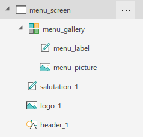
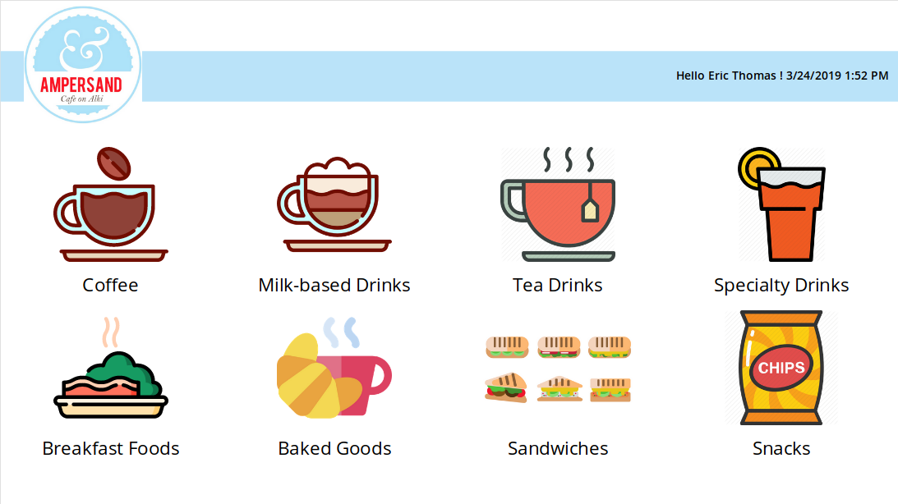
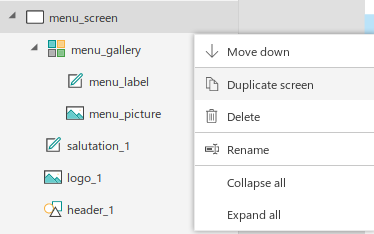

# Real World PowerApps App Development: Session 2

## Goals

- Ensure everyone has access to PowerApps
- Download and Connect to the Data Source (Excel spreadsheet)
- Discuss initial app options and settings (phone/tablet, app settings, etc.)
- Build Screen 1 and Screen 2 of the Coffee Shop Application

## Get access to PowerApps

- If your org has O365:
    - You already have PowerApps access
    - Visit create.powerapps.com
- If your org does **NOT** have O365:
    - Visit powerapps.com
    - Click `Get Started Free`
    - Sign up for a Plan 2 Trial
    - CRITICAL: If your Trial ends before you signup officially, you will lose your apps!
- To purchase an O365 license:
    - Visit `https://products.office.com/en-US/compare-all-microsoft-office-products?&activetab=tab:primaryr2`
    - Select a plan
- **Bonus:** To purchase an Azure account:
    - Visit `https://azure.microsoft.com/en-us/free/`
    - Click `Start Free`

## App and Asset Downloads

- Download the Realworld PowerApps [Session 2 Asset Pack](./assets/session2.zip)
    - This asset pack contains the latest data and sample app we'll be working from.
- Save this somewhere logical
- Extract the `session2.zip` file so its accessible
- Begin the exercises below by building the app as outlined below. 
    - Do not import the app straightaway unless you just want to dissect it.

## Instructions

### Initial Setup

1. Fire up laptops and visit `create.powerapps.com`
2. Choose `Tablet` layout
3. Select `View`, `Data Sources`, select `Import from Excel`
4. Choose the `cosffeeShopData.xlsx` file in the Asset Pack
5. Select all tables
6. Choose `File` then `Save`. Name this new app something memorable.

### Configure the Menu Screen

For the following instructions, remember the screen size for our app is 1366 x 768

1. Rename Screen Control to `menu_screen`

2. Create "Responsive-ready" Header, Salutation and Logo

- **Header Shape**
    - **Control Type:** Icon
    - **Instructions:**
        - Click `Insert` then `Icon`
        - Select `Rectangle` (Near the bottom of the menu)
        - Place and stretch the header shape to a *general* representation
    - **Properties:**
        - Rename to: `appHeader_1`
        - Fill: `ColorValue("#BAE3F9")`
        - X: `menu_screen.Width - menu_screen.Width`
        - Y: `menu_screen.Height / 10`
        - Width: `menu_screen.Width`
        - Height: `menu_screen.Height / 10`

- **Salutation**
    - **Control Type:** Label
    - **Instructions:**
        - Click `Insert` then `Label`
    - **Properties:**
        - Rename to: `appSalutation_1`
        - Text: `"Hello " & User().FullName & " !" & Char(10) & Now()`
        - X: `menu_screen.Width - (Len(salutation_1.Text) * 10) - 10`
        - Y: `header_1.Y + (header_1.Height / 4 )`
        - Width: `Len(salutation_1.Text) * 10`
        - Height: `header_1.Y + (header_1.Height / 2.5)`
        - FontWeight: `FontWeight.Semibold`

- **Logo**
    - **Control Type:** Image
    - **Instructions:**
    - Click `Insert` then `Media` then `Image`
    - **Properties:**
        - Name: `logo_1`
        - X: `menu_screen.Width - 1330`
        - Y: `menu_screen.Height - 760`
        - Width: `180`
        - Height: `180`
        - Image: `LookUp(datAssets, AssetDesc = "Ampersand Logo", AssetURL)`

3. Create Menu Gallery, Menu Icons and Descriptions

- **Gallery**
    - **Control Type:** Gallery
    - **Instructions:**
    - Click `Insert` then `Gallery` then `Blank vertical`
    - **Properties:**
        - Name: `menuGallery`
        - Items: `datCategories`
        - X: `menu_screen.Width - 1366`
        - Y: `menu_screen.Height - 550`
        - Width: `menu_screen.Width`
        - Height: `550`
        - Transition: `Transition.Pop`
        - WrapCount: `4`
        - TemplateSize: `245`
        - OnSelect: `Navigate(submenu_screen, Cover)` 
            - NOTE: This will cause an error until you duplicate the `menu_screen` and name it accordingly (step 5 below :) ).

    - **Subcontrol Type:** Image
        - NOTE: These "subcontrols" MUST be placed INSIDE the `menu_gallery`. It can be tricky to correctly place subcontrols.
        - **Instructions:**
            - Click the `menu_gallery`
            - Click the pencil icon ON THE GALLERY
            - This will open the gallery "template" where subcontrols can be placed.
        - Once in the gallery template, click `Insert/Media/Image`
        - Name: `menu_picture`
        - Image: `ThisItem.Image`
        - X: `0`
        - Y: `0`
        - Width: `325`
        - Height: `175`

    - **Subcontrol Type:** Label
        - **Instructions:**
            - Click `Insert` then `Label`
        - Name: `menu_label`
        - Text: `ThisItem.Category`
        - X: `0`
        - Y: `175`
        - Width: `325`
        - Height: `65`

4. Results:

- Control Tree should look like this:
    - 
- UI Should look like this: 
    - 

5. Duplicate the screen

- Click the three dots on the Screen Control
- Click `Duplicate screen`
- 
- See how the naming convention was "automated" for screen2
- All app elements (Heading, Salutation, Logo, Gallery) are duplicated. 
- Once out of experimental phase, you'd create Heading/Salutation/Logo using [PowerApps Components](https://docs.microsoft.com/en-us/powerapps/maker/canvas-apps/create-component).
- This allows you to build the element once and reuse on every screen.

### Configure the Submenu Screen

1. Rename the duplicated screen control to `submenu_screen`

2. Create Submenu Gallery, Submenu Icons and Descriptions

- **Gallery**
    - **Control Type:** Gallery
    - **Instructions:**
        - Reuse existing Gallery from the duplicate screen action
    - **Properties:**
        - Name: `submenu_gallery`
        - Items: `Filter(datMenu, Category = menu_gallery.Selected.Category)`
    - **Subcontrol Type:** Image
        - Name: `submenu_picture`
        - Image:
            ```
            Switch(
                ThisItem.DescriptionShort,
                "Espresso",
                LookUp(datAssets, AssetDesc = "Demitasse Cup", AssetURL),
                "Iced Tea",
                LookUp(datAssets, AssetDesc = "Cold Cup", AssetURL),
                "Italian Soda",
                LookUp(datAssets, AssetDesc = "Cold Cup", AssetURL),
                LookUp(datAssets, AssetDesc = "Hot Cup", AssetURL)
            )
            ```
        - X: `0`
        - Y: 
        ```
        Switch(
            ThisItem.DescriptionShort,
            "Espresso",
            80,
            0
        )
        ```
        - Width: `325`
        - Height:
        ```
        Switch(
            ThisItem.DescriptionShort,
            "Espresso",
            100,
            185
        )
        ```
    - **Subcontronl Type:** Label
        - Name: `submenu_label`
        - Text: `ThisItem.DescriptionShort`

3. Make clicking the logo navigate user back to Menu Screen

- **Logo**
    - **Control Type:** Image
    - **Properties:**
        - OnSelect: `Navigate(menu_screen, Cover)`

4. Test progress so far.

- Click the preview button ("Play" button in top right corner of editor)
- **Action:**
    - From the `submenu_screen` click the logo
- **Result:**
    - User taken to `menu_screen`
- **Action:**
    - Click `Milk Based Drinks` picture (or description)
- **Result:**
    - User is taken to `submenu_screen` and ONLY milk based drinks are shown
- Repeat with all other menu items. 
- **Known Issues:** As of Sun Mar 24 15:14:37 PDT 2019, there are no submenu graphics for food items. These graphics will be added when I can find a graphic artist to create them for cheap :) 