# Working With Solutions in PowerApps Canvas Apps

## Introduction

Solutions allow you to implement custom functionality into your PowerApps. Only recently, this feature was extended to include Canvas apps. These instructions will guide you through how to import a solution into your environment and enable their use for Canvas apps.

## Pre-requisites

- [Suitable privileges](https://docs.microsoft.com/en-us/power-platform/admin/create-environment-powerapps) to create a PowerApps environment
- A PowerApps per-user, per-app, trial or community Plan
- Common Data Service (CDS) instance AND capacity
  - CDS will *soon* come with every new environment (depends on your **current** licensing)
	- Each CDS instance requires 1GB of capacity
	- Each paid PowerApps Plan comes with some CDS capacity
	    - See [page 15](https://go.microsoft.com/fwlink/?LinkId=2085130&clcid=0x409) of the `2020 PowerApps and Power Automate Licensing Guide`
			- 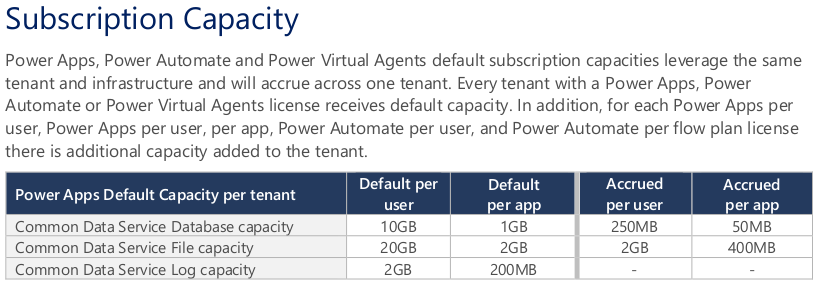
- A PowerApps Component Framework (PCF) Solution to import!
  - See [`pcf.gallery`](https://pcf.gallery/canvas-controls) for some examples

## Instructions

1. **Create a new PowerApps environment and CDS instance**
  - Go to `admin.powerapps.com`
	- Click `New Environment`
	- Name the environment
	- Select `Trial` or `Production` (**Careful!**: `Trial` auto-expires after 30 days)
	- 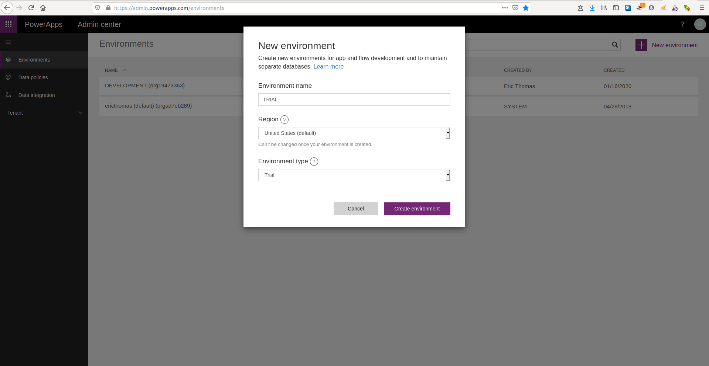
	- Click `Create Database`
	  - This will create a CDS instance for the new environment
		- Solutions are stored in CDS
		- 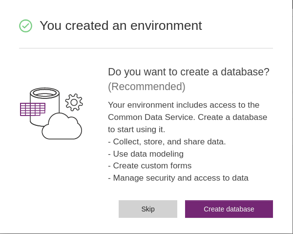
		- Select `Currency`, `Language` and whether to load sample data
		  - If you're low on CDS capacity, uncheck this
			- Note TOS here
			- 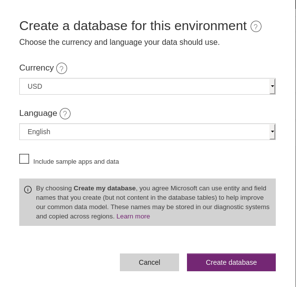
		- Click `Create Database`
    - **Note**: This can also be done in an automated fashion using the [Power Automate PowerPlatform for Admins](https://docs.microsoft.com/en-us/connectors/powerplatformforadmins/) actions or the [PowerApps PowerShell cmdlets](https://powerapps.microsoft.com/en-us/blog/gdpr-admin-powershell-cmdlets/)

2. **Enable PCF Components for Canvas apps**
  - **Critical**: You must do this ***before*** performing step 3!
	- Go to `admin.powerplatform.microsoft.com`
	- Click the `Environments` tab on the left
	- Click the three dots next to the new environment then `Settings`
	- 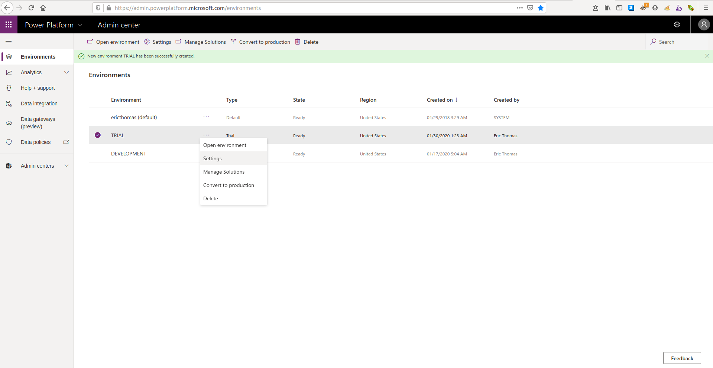
	- Expand `Products` then click `Features`
	- 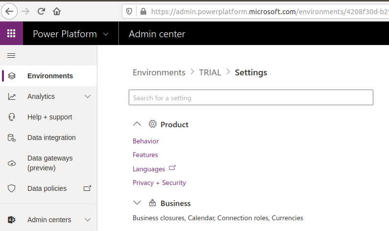
	- Toggle `On`, `Power Apps component framework for canvas apps`
	- Click `Save`
	- 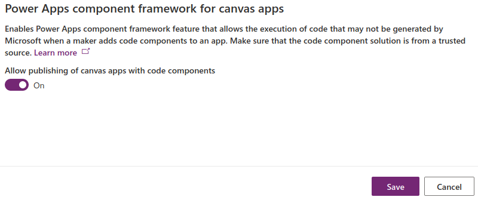
	- Close the browser tab

3. **Import the solution into the environment**
  - Open a new browser tab and go to `make.powerapps.com`
	- **Important**: Select the new environment in the top right corner
	- Click `Solutions`
	    - **Note**: The environment will show some default solutions installed *even if* you unchecked `Include sample data` when creating the CDS instance
			- 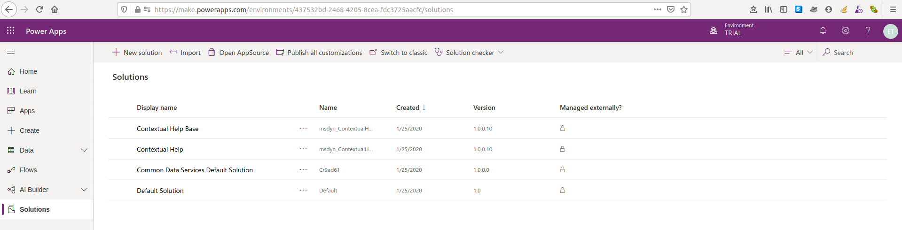
	- Click `Import`
	- From the popup, click `Browse` and select the solution `.zip` file
	- 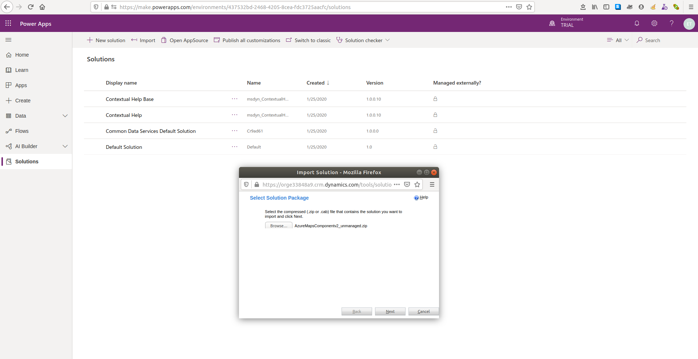
	- Click `Next` then `Import`
	- A progress popup will appear. When complete a success popup will appear.
	- 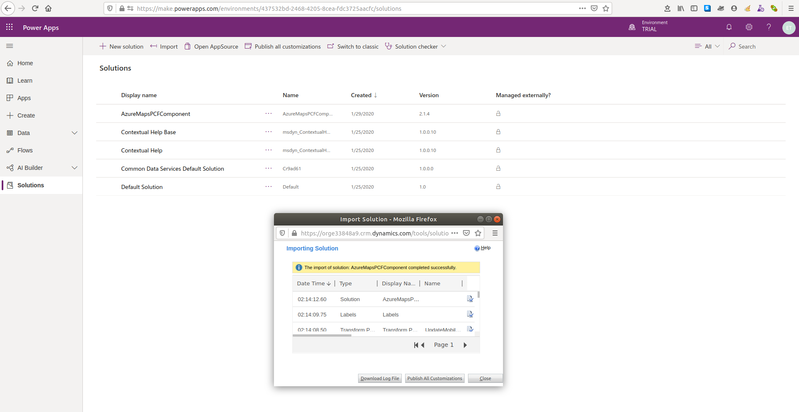
	- **Interesting Note**: If you have an *existing* version of the solution installed in the current environment, the *new* version **will not** install.
	- Click `Publish all customizations` then `Close`.
	- 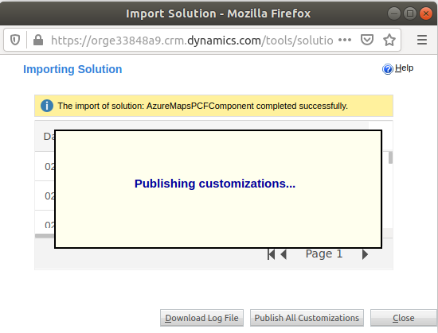
	- The component is now available to **all apps** within the environment!

4. **Import custom component into a PowerApp canvas app**
  - From `make.powerapps.com`, click the `Apps` tab on the left
	- Click `+ New app` then select `Canvas`
	- 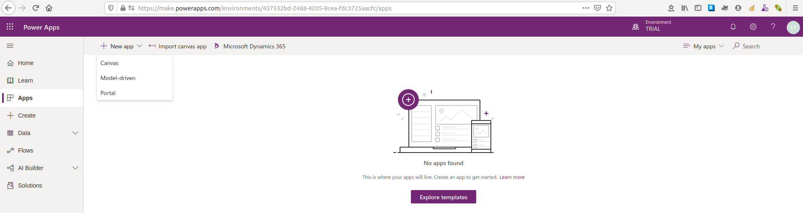
	- Under `Blank app` select `Tablet layout`
	- 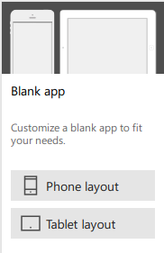
	- When the new canvas loads, click `File`, `Settings` then `Advanced settings`
	- Toggle `On`, `Components` under the `Experimental features` section
	- 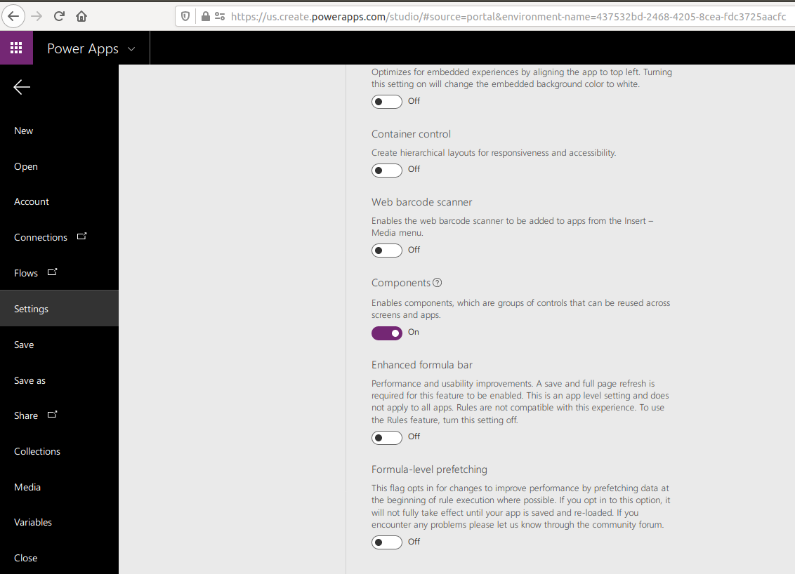
	- Click the back arrow
	- Back on the PowerApps canvas, click `Insert`, `Custom` then `Import component`
	- 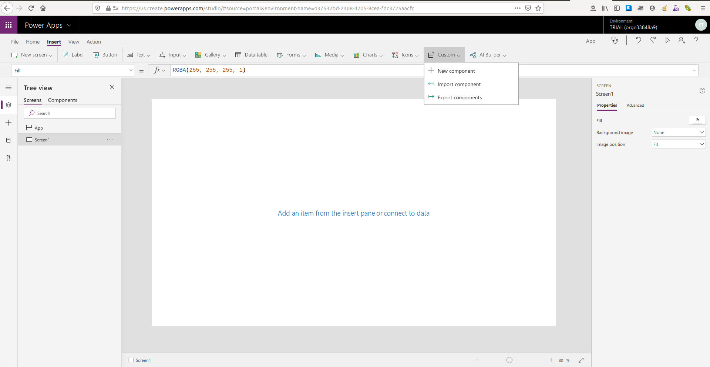
	- Once the flyout loads, click the `Code` tab near the top, select the component then click `Import`
	- 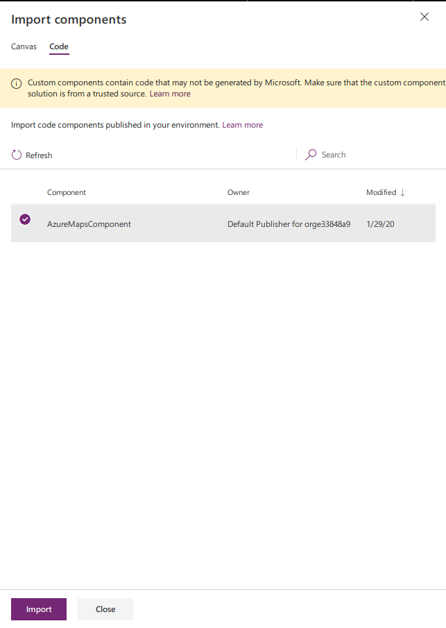
	- On the left, click the `+`, then expand `Code components` and select the component
	- Initialize your component as applicable
	- Click `File`, `Save` then `Publish` to make your app available to others within your org
	- Click `Close` to fully close out the app
	- Re-open the app. Notice the message displayed. Its important to have a process around ensuring safe PCF components
	- 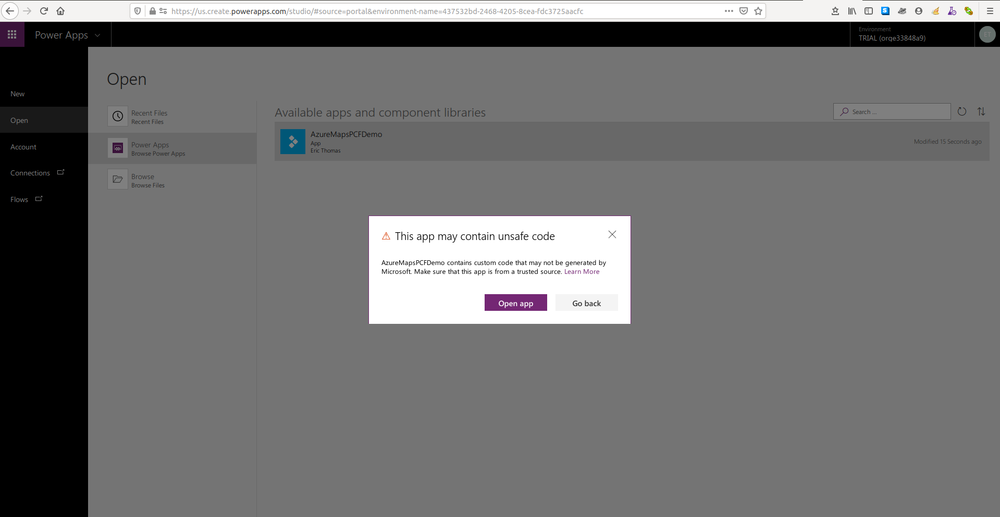

## Further Reading

- [Intro to solutions](https://docs.microsoft.com/en-us/powerapps/developer/common-data-service/introduction-solutions)
- [PCF Components for Canvas Apps](https://docs.microsoft.com/en-us/powerapps/maker/canvas-apps/create-component)