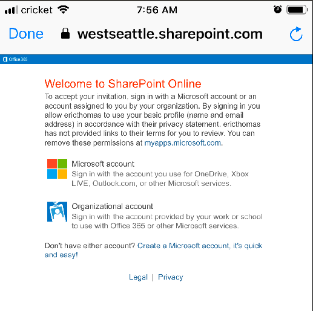
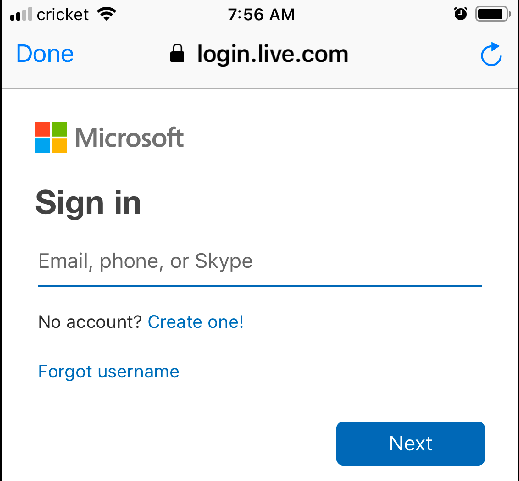
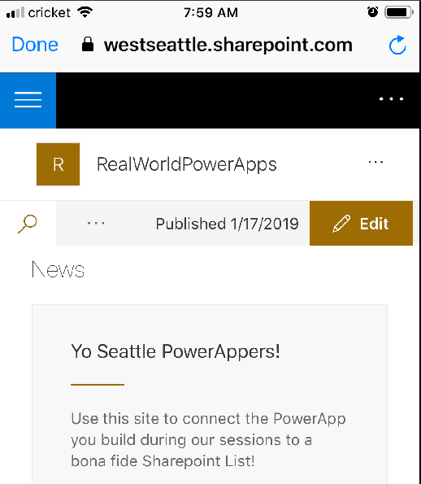
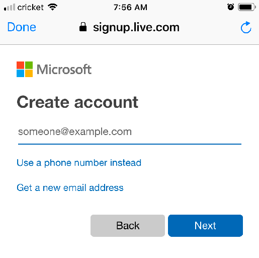
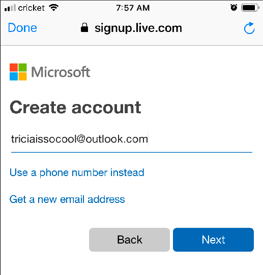
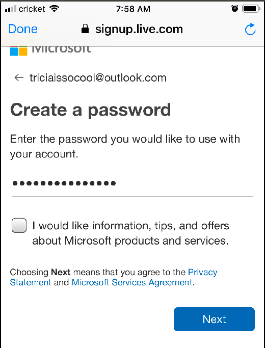
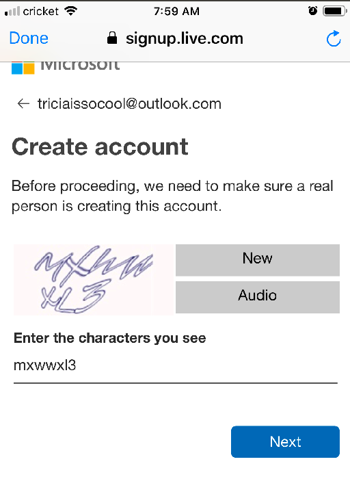

# How to access Seattle PowerAppers Sharepoint Site

- Created: Sat Jan 26 08:10:41 PST 2019
- Updated: 
- To contribute energy:
    - [Venmo](https://venmo.com/powerappsrocks)
    - [Patreon](https://patreon.com/powerappsrocks)

## Introduction

- The [Seattle PowerAppers Sharepoint Site](https://westseattle.sharepoint.com/realworld/) is used to store and share images and files associated with the apps we build together. 
- It is an "external-facing" Sharepoint site that is accessible by people **with a Microsoft account** of some kind (@outlook/@hotmail.com/etc.). 
- Microsoft accounts are free. The instructions below guide you through how to login to the site and obtain a Microsoft email account if necessary.

## Instructions

- Ask [Us](mailto:info@powerapps.rocks) to share the site with you
- We will add you to the site and send you a link
- Open the link and click `Microsoft Account`
    - 
- Login with your Microsoft Account (@Outlook.com, @Hotmail.com, etc.)
    - 
- You're in!
    - 

### No Microsoft Account?

- Click "Create one!"
- Choose a unique email address (@outlook.com), click `Next`
    - 
    - 
- Create a good password and click `Next`
    - 
- Enter a name and a birthdate
- Type in the characters on the screen and click `Next`
    - 
- You should now see the Seattle PowerAppers Sharepoint site
    - 
- You might have to revisit [the original link](https://westseattle.sharepoint.com/realworld/) to open the site

Qlop%ttv1