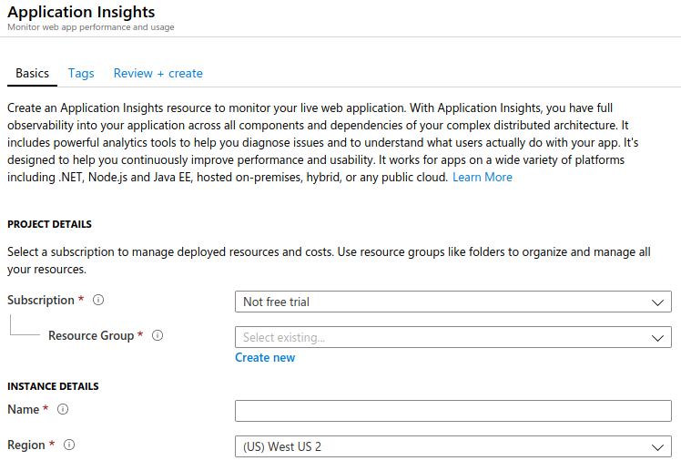
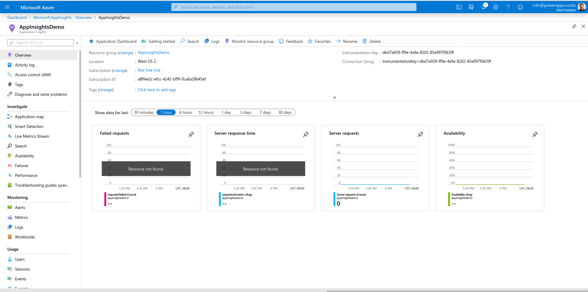
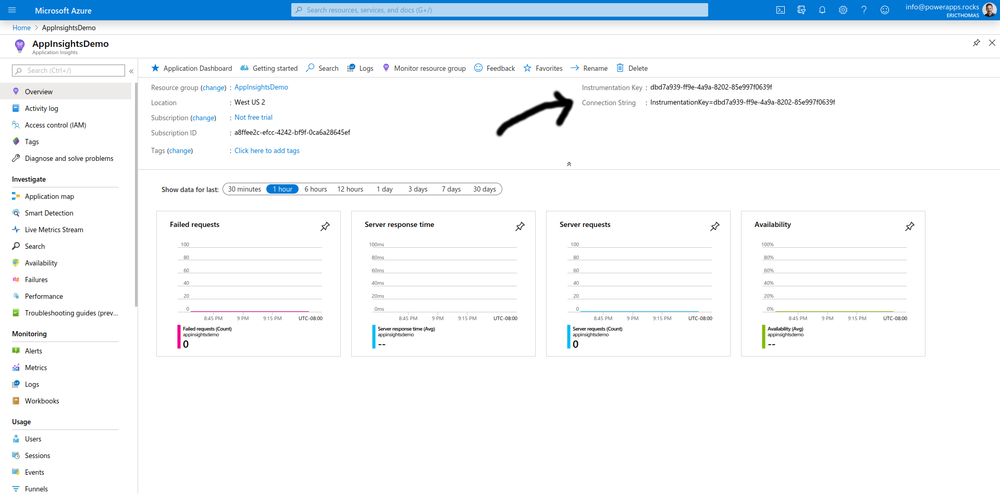
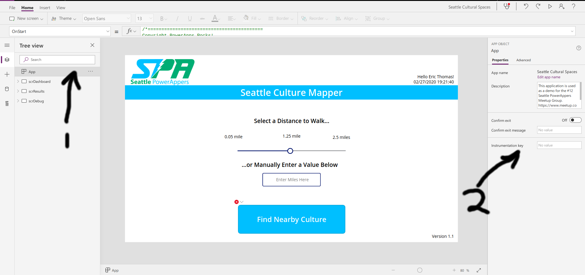
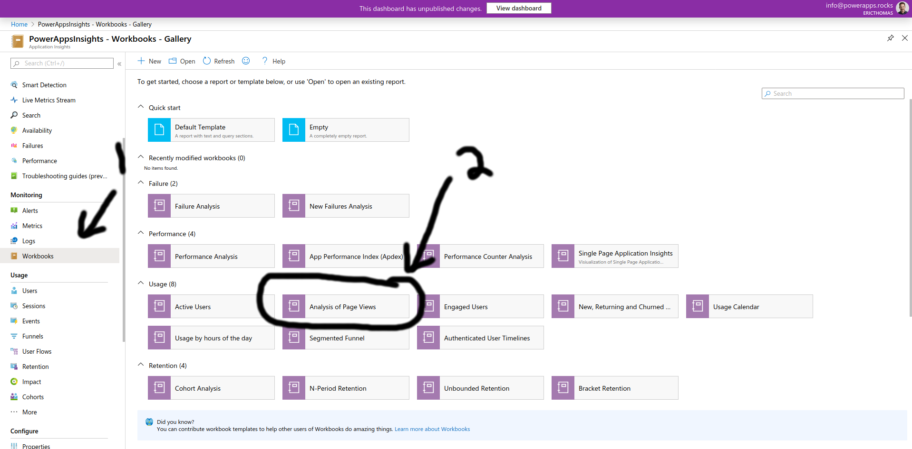

# Meetup #15

## Advanced PowerApp User Metrics and Logging

- **Time:** Sat Feb 29 11:00-2:00 PDT 2019
- **Venue:** [Delridge Library 5423 Delridge Way SW Seattle, WA 98106](https://www.google.com/maps/search/?api=1&query=Delridge+Branch+-+The+Seattle+Public+Library%2C+5423+Delridge+Way+SW%2C+Seattle%2C+WA%2C+98106%2C+us&query_place_id=ChIJ3aIMp6lBkFQRoIT0hrJlwwk)
- **To contribute energy:**
  - [Venmo](https://venmo.com/powerappsrocks)
      - 
  - [Patreon](https://patreon.com/powerappsrocks)
      - 

## Introduction

A recent [PowerApps Blog post](https://powerapps.microsoft.com/en-us/blog/log-telemetry-for-your-apps-using-azure-application-insights/) detailed how to use Azure [AppInsights](https://docs.microsoft.com/en-us/azure/azure-monitor/app/app-insights-overview) to log detailed user metrics within PowerApps.

This is a huge leap forward and advances [Application Performance Management(APM)](https://en.wikipedia.org/wiki/Application_performance_management) for low-code apps. If a user says "this app loads slow", you can now determine more details into the root cause. The default AppInsights metrics are good as-is. The tool also allows you to create *custom traces* to monitor the parts of an app that are important to you.

## Pre-requisites

- **Azure Subscription**
  - Start [free](https://azure.microsoft.com/en-us/free/)
	- Pay-as-you-go thereafter

- **Azure AppInsights service**
  - Billed based on amount of telemetry data *processed*, data *stored* and optionally, custom metrics
	- Processing costs: 5GB/month free; $2.30/GB thereafter
	- Storage costs: 90 days free; $.10/GB thereafter
	- Custom metric costs: 150MB/month free; varies based on size of queries thereafter

- **PowerApps Subscription**
	- Requires an organizational email address
	- Costs vary:
	  - [Community Plan](https://docs.microsoft.com/en-us/powerapps/maker/dev-community-plan) (free)
		- Included with some Office365 and Dynamics365 plans
		  - Visit `make.powerapps.com` and sign in to see if your organization already has licenses
		- [Stand-alone licenses](https://powerapps.microsoft.com/en-us/pricing/#) $10 to $40/month

- **An app to test with**
  - Visit the [Seattle PowerAppers Github Repo](https://github.com/SeaDude/seattlePowerAppers) for some samples if needed

## Instructions

### Create a new Azure AppInsights instance

- Visit `portal.azure.com` and sign in (if applicable)
- In the search bar, type `Application Insights`
- Click `+Add`
- Select an Azure Subscription to use
- Select or create a new Resource Group
- Name the instance
- Select a region close to your users (if possible)
- 
- Click `Next` to add tags to the service (optional; makes finding things easier when you have lots of Azure services)
- Click `Review and Create`
- Click `Create`
- Deployment will take ~10-15 seconds
- Click `Go to resource`
- You should see the AppInsights `Overview` screen


### Enable AppInsights in a PowerApp

To begin collecting metrics from a given PowerApp, you just need to add the AppInsights Instrumentation Key. This simple action will automate the collection of data and metrics within your app!

- Copy the `Instrumentation Key` (aka "Connection string") from your AppInsights service

- Visit `make.powerapps.com` and open the app you'd like to track in Edit mode
  - **HINT:** The more screens your app has, the more interesting the metrics will be at this point.
- Click the `App` control in the `Tree View` (1) then paste your Instrument Key in the field shown below (2)
- **NOTE:** YOu should only paste in the key part, not `Instrumentationkey=`.
- **Example:** 3a35353-5f66-445bd-8452-1b454500d7d

- Click `File` then `Save` then `Publish`

### Create Some Metrics

Unless you have an app deployed in production to an active user base, you will not see many metrics being created. So lets create some.

- Open the player version of the given PowerApp
- Refresh the screen 10x or so then navigate around the app (**Careful not to create records if this is a production app!** :P )
- Open the iOS and/or Android version of the given PowerApp and navigate around as well

### View AppInsights Logs and Metrics

- Navigate back to the `Overview` screen of your AppInsights service in Azure
- Click `Workbooks` then `Analysis of Page Views`

- Scroll through the available analytics and be amazed!
- Explore the other `Workbooks` as well

### Use the `Trace()` function to create custom metrics

Add this code to the `OnStart` property of your application:

```powerapps
Set(varSessionCode, GUID())
Trace("User Login", TraceSeverity.Information,
    {
        environName: "DEV",
        appName: "Seattle Culture Finder",
        appVersion: "1.1",
        sessionCode: varSessionCode,
        userName: User().FullName,
        userEmail: User().Email,
        startLat: Location.Latitude,
        startLong: Location.Longitude,
        startAltitude: Location.Altitude,
        deviceType: If(IsBlank(Location.Altitude), "Desktop Browser", "Mobile Device"),
        sessionStartUTC: Text(Now(),DateTimeFormat.UTC),
        sessionStartLocal: Text(Now(),"[$-en-US]yyyy-mm-ddThh:mm:ss.s"),
        sessionTimezone: 
            If(TimeZoneOffset() > 0, "-", "+")
            & RoundDown(Abs(TimeZoneOffset()) / 60, 0)
            & ":"
            & If(Mod(Abs(TimeZoneOffset()), 60) < 10, "0", "")
            & Mod(Abs(TimeZoneOffset()), 60)
    }
)

```

- Click `File` then `Save` then `Publish`
- Generate some metrics by opening and closing the application a few times
- Ideally, open and close the app on multiple devices
- Navigate to Azure Portal, open AppInsights and click `Search`
- Type in `User Login` (the name of the `Trace` message shown above)
  - There are ways to query these traces using Kusto

### Caveats

- AppInsights collects data only in the PowerApps *Player*, **not** the *Editor*.
- To use the AppInsights out-of-the-box reports, you will need 1 AppInsights instance per app
- You can combine multiple apps in a single AppInsights instance, but this will require custom `Kusto` queries to combine tables

### Resources

- [GDPR: What is Personal Data?](https://ec.europa.eu/info/law/law-topic/data-protection/reform/what-personal-data_en)
- [California Consumer Protection Act (CCPA): Fact Sheet](https://oag.ca.gov/system/files/attachments/press_releases/CCPA%20Fact%20Sheet%20%2800000002%29.pdf)
- [Getting started with Azure Log Analytics](https://docs.microsoft.com/en-us/azure/azure-monitor/log-query/get-started-queries?toc=%2Fazure%2Fazure-monitor%2Ftoc.json)
- [Kusto](https://docs.microsoft.com/en-us/azure/kusto/query/) query language
  - Used to query AppInsights

**Example Kusto query** 

- From the AppInsights `Overview` screen, click `Logs` then paste this into the query window
- Adjust the `start` and `end` times to capture test data you created above

``` Kusto
// average pageView duration by name
let start=datetime("2020-02-28T02:31:00.000Z");
let end=datetime("2020-02-28T03:54:00.000Z");
let timeGrain=1s;
let dataset=pageViews
// additional filters can be applied here
| where timestamp > start and timestamp < end
| where client_Type == "Browser"
| where (isempty(cloud_RoleName));
dataset
// render result in a chart
| render timechart
```
