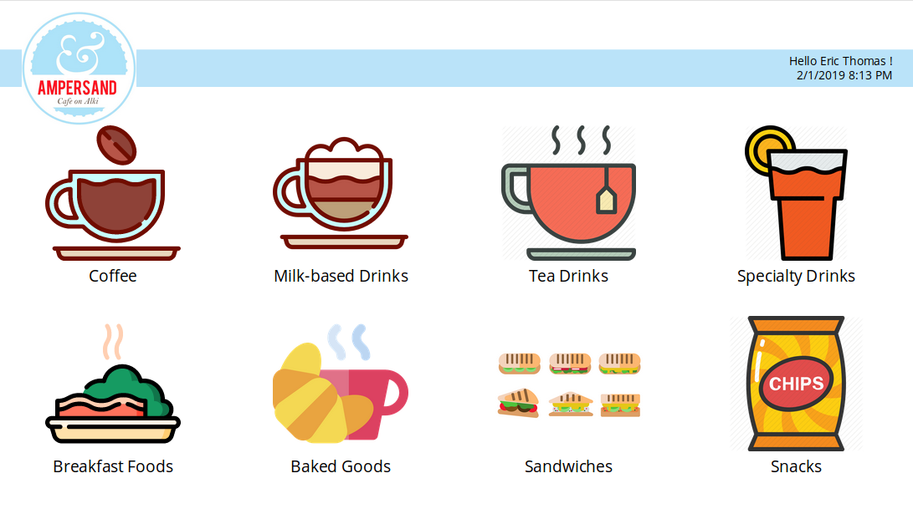

# Real World PowerApps App Development: Session 2

## Goals

- Ensure everyone has PowerApps licenses
- Download and Connect to the Data Source (Excel spreadsheet)
- Create a new PowerApp, discuss options (phone/tablet, app settings, etc.)
- Build out Phase 1 of Coffee Shop Application

## Steps

### Initial Setup

- Download Excel spreadsheet from SeattlePowerAppers Github account
- Fire up laptops and visit `create.powerapps.com`
- Choose `Tablet` layout
- Select `View`, `Data Sources`, select `Import from Excel`

### SelectItems Screen

- Rename Screen Control to `SelectItems`
- Create Header and logo
    - Header
        - Control: Icon (Insert, Icon, Rectangle)
        - Properties:
            - Fill: `ColorValue("#BAE3F9")`
    - Salutation
        - Control: Label
        - Properties:
            - Text: `"Hello " & User().FullName & " !" & Char(10) & Now()`
    - Logo
        - Control Type: Image
        - Properties:
            - Image: `logo`
- Review Excel sheet together
    - Note the TABLE NAMES
    - Get a general feel for the data
- Connect the PowerApp to the Excel Data Source
    - View, Data Sources, New Connection, Excel
    - Select Tables (Hint: this is why the tables are named in Excel)
- Insert Blank Gallery
    - Set `Items` Property to `Categories`
    - Insert an Image Control
        - Set Image Property to `ThisItem.Image`
    - Insert a Label Control
        - Set `Text` Property to `ThisItem.Category`
        - Show the various elements exposed via dot notation
        - Explain `TemplateSize` Property
        - Set `Wrap count` Property of Gallery to 4
    - Set `Transition` to `pop`
        - Illustrate the effects
    - Set `OnSelect` to `Navigate(ConfigureItem, Cover)`
        - Talk about the different transitions
- Name Controls accordingly
    - Show the `_1` trick
- 
- Duplicate screen
    - Show how the naming convention was "automated" for screen2

### ConfigureItems Screen

- Change the Gallery Items Property to `Filter(Menu, Category = categoryGallery_1.Selected.Category)`
- 

### Tips and Tricks

- Reading Functions (aka: "Formulas" or "Statements")
    - Start with the middle of the Function
    - Work your way outward
    - Place Controls on the screen with parts of the formula to evaluate as you go