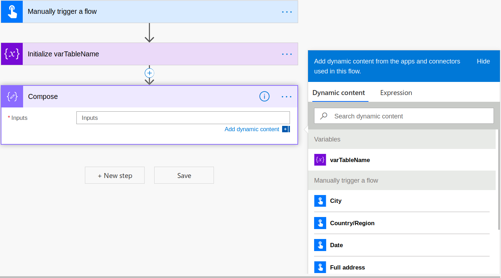

# Seattle PowerAppers Meetup #11

## Automate Your Day With PowerApps and Flow

- **Time:** Sat Oct. 19 11:00-2:00 PDT 2019
- **Venue:** [Delridge Library 5423 Delridge Way SW Seattle, WA 98106](https://www.google.com/maps/search/?api=1&query=Delridge+Branch+-+The+Seattle+Public+Library%2C+5423+Delridge+Way+SW%2C+Seattle%2C+WA%2C+98106%2C+us&query_place_id=ChIJ3aIMp6lBkFQRoIT0hrJlwwk)
- **To contribute energy:**
  - [Venmo](https://venmo.com/powerappsrocks)
    - 
  - [Patreon](https://patreon.com/powerappsrocks)
    - 
- **To contact me directly:**
  - [Email me](mailto:info@powerapps.rocks)

### Introduction

[Microsoft Flow](https://flow.microsoft.com) is a powerful and VERY extensible automation tool. Flow has been around since 2016 and comes with many O365 and D365 subscriptions. Its also available as a [standalone license](https://us.flow.microsoft.com/en-us/pricing/) when a high number of runs or premium features are required.

A "Flow" consists of a single **Trigger** and one or many **Actions**. **Triggers** can take multiple forms. Anything from a manual Button push (from [the Flow mobile app](https://apps.apple.com/us/app/microsoft-flow/id1094928825?ls=1)) to an automation based on a new SQL record being created can trigger a Flow. Triggers can also have conditions.


**Example:**

- **Trigger**: When an Item is Created in Sharepoint List XYZ
- **Trigger Condition**: Only trigger when Column ABC is equal to "Test"

**Actions** are tasks *or Logic Operators* that execute in a defined sequence once a Trigger fires. There are hundreds of out-of-the-box Actions (more than a thousand?) and more than 10 Logic Operators to choose from. Test if a Condition is true, add new records to a SQL DB, send an email your boss, post to a social media platform, etc. With the `Send HTTP Request` Action, the sky is the limit if you know how to interact with REST API's. Many different types of business tasks can be automated with a creative Flow.


Along with Triggers and Actions, Flow also features robust Monitoring, Run History and real time Run Progress indicators that allows you to review performance and quickly iterate. You can watch Flows execute in real time and determine the output of each step and exactly where problems occur.


### Definitions

- **Dynamic Content:**
  - Properties from the Trigger and *previous* Actions which Flow makes available for use in *subsequent* Actions.
  - **Example:**
    - *After* a variable has been initialized, its value becomes available in the Dynamic Content area for use in *subsequent* Actions.
      - 
- **Expressions:**
  - Flow is really just a business-user-facing UI for [Azure Logic Apps](https://docs.microsoft.com/en-us/azure/logic-apps/logic-apps-overview) which is a superuser-facing UI for [Workflow Definition Language (WDL)](https://docs.microsoft.com/en-us/azure/logic-apps/workflow-definition-language-functions-reference)
  - Because of this, you can specify raw WDL syntax in a Flow using **Expressions**
  - Expressions are a more powerful and succinct method of working with Actions and Triggers
  - **Example:**
    - The following Expression takes the value of a string variable (varTableName), replaces all spaces (' ')with underscores ('_') and converts the variable to uppercase
    - `toUpper(replace(variables('varTableName'), ' ', '_'))`
    - WDL syntax is can be challenging to learn but is suuuper powerful once you have the basics down
    - Here are some helpful hints to get started.
      - Notice how `?`'s are used to "dig" into the nested JSON **Objects**
        - Also notice how the parenthesis do not close around the statement, but rather around the Flow Action
          - `wdl_command('flow_action_name')?['json_parent_object']?['json_child_object']`
        - Notice how `[0]` is used to "dig" into the JSON **Array**
          - `wdl_command('flow_variable_name')?['json_array'][0]['json_object_in_array']`
        - Notice how WDL is built from the inside-out
          - `wdl_command2(wdl_command1('flow_action_name',value1),value2`)
    - The Expression window within Flow is only a single line tall
      - For multiline/complex Expressions, it is beneficial to create them in a text editor then paste into Flow to test

### Goals for this exercise

1. Create a Flow to automate the creation of Sharepoint lists
2. Learn professional Flow dev methods such as:
    - Button trigger
    - Compose Action
    - Terminate Action

### Prerequisites

To create Flows, you will need either:

- A [qualifying Dynamics account]() 
- A [qualifying Microsoft Office account](https://go.microsoft.com/fwlink/?LinkId=2085130&clcid=0x409) (see Appendix D) ($5-12.50/month)
- A [standalone PowerApps license](https://powerapps.microsoft.com/en-us/pricing/) ($15-40/month)
- A [PowerApps trial](https://docs.microsoft.com/en-us/powerapps/maker/signup-for-powerapps) (free, requires a non-personal email address)
- A [PowerApps Community Plan](https://powerapps.microsoft.com/en-us/communityplan/) (free)
- An [O365 Developer Plan](https://developer.microsoft.com/en-us/office/dev-program) (free, expires after 90 days)

If you do not have access to one of the licenses above, your instructor will provision you a temporary account to follow along.

### Create Flow to create a Sharepoint List

1. Using a web browser, visit [flow.microsoft.com](https://flow.microsoft.com)
2. Click `Create` then `Instant flow`
    - 
3. Name the Flow `CREATE_SP_LIST_DEV`
4. Click `Skip`
5. Type `button` into the Trigger search bar
    - Click `Manually trigger a flow` in the Triggers and Actions area
    - 
6. Click `Add an input` then `Text`
7. Change `Input` to `Table Name`
    - 
8. Click `New Step` and type `initialize variable`
9. Click the `Initialize variable` step
    - 
10. Click the three dots on this action then `Rename`
    - Change name to `INIT varTableName`
    - Just like you name every control in a PowerApp, name every action in Flow
11. Set the following values for this action
    - Name: `varTableName`
    - Type: `String`
    - Value: Select the `Table Name` Dynamic Content
    - 
12. Click `Save` then `Test` then `I'll perform trigger action`
13. Enter the Table Name (this will be the Sharepoint list name in the future) and click `Run Flow`
    - The Flow will run in real-time
    - Once complete, look for green checks on each successful Action
    - Unsuccessful Actions will show a red "X"
    - Click the Trigger and Action boxes to expand and view input/output
    - Post-run/test input/output is VERY valuable
14. Click `Edit`
15. Repeat the steps above to add a `Table Description` step to the Trigger and a corresponding variable called `INIT varTableDesc`
    - Should end up with this
    - 
16. Click `New Step`
17. Type `Send an HTTP` into the Action search bar
18. Select `Send and HTTP request to Sharepoint`
19. Click the three dots on this action then `Rename`
    - Change name to `HTTP POST new list`
20. Set the following values for this action:
    - Site Address: Select the site where the list will be created
    - Method: `POST`
    - Uri: `_api/web/lists/`
    - Headers: `content-type` then `application/json;odata=verbose`
    - Body: Paste in the JSON below

``` JSON
{
    '__metadata': { 'type': 'SP.List' },
    'AllowContentTypes': true,
    'BaseTemplate': 100,
    'ContentTypesEnabled': true,
    'Description': 'My first test list',
    'Title': 'The coolest list ever'
}
```

21. Click `Save` then `Test` then `I'll perform trigger action`
22. **IMPORTANT:** Open a new browser tab and navigate to the Sharepoint site where new list will be created.
    - Click the gear icon then `Site Contents`
    - Here is where you will see the new list created
23. Back in Flow, enter a Table Name and Description
24. Click `Test Flow` and follow prompts
25. After the Flow runs successfully, refresh `Site Contents` and verify list was created
    - 
26. Back in Flow, expand the Actions to view inputs/outputs
    - **REMEMBER**: This is a powerful method for learning HOW things work in Flow
    - There are many times you will visit a failed/successful run to copy JSON schemas, adjust Expressions, etc.
    - Take time studying Flow runs!
27. 
28. Click `Edit`
29. **IMPORTANT:** Delete the newly created list from Sharepoint
30. Back in Flow, in the `Create new Sharepoint list` Action `Body`, delete the `Description` text and replace it with `varTableDesc` Dynamic Content.
31. Do the same for the `Title` text. Replace it with `varTableName` Dynamic Content
32. Click `Save` then `Test` and run through the testing sequence
    - Notice how the Table Name and Description are now based on user input rather than static values defined in the Action itself.
    - THIS IS AN IMPORTANT CONCEPT TO GRASP: Make values dynamic as much as possible.

### Look at Run Histories

1. Click the back arrow **IN FLOW** (not the browser!)
2. Scroll down under `Runs` and select a previous run
3. Expand each action
    - This is a critical tool for accessing input/output from successful Actions
    - In the future, you will use this info to copy JSON schemas, interrogate strings, etc.
4. Take special note of the Create new Sharepoint List `Body` **output**
5. Click `Edit` to get back to your Flow

### Create a new Sharepoint list with various column types

1. **IMPORTANT:** From `Site Contents` in the Sharepoint site, **delete** the list you just created.
    - If you don't, the Flow will fail.
2. Back in Flow, expand the Button Trigger and add 4 additional **Text** Inputs
    - `Column 1 Name`
    - `Column 1 Type`
    - `Column 2 Name`
    - `Column 2 Type`
    - 
3. For BOTH `Column 1 Type` and `Column 2 Type`, click the three dots and select `Add a dropdown list of options`
    - Enter the following options (be sure to spell each correctly and observe punctuation):
        - `Single line of text`
        - `Multi-line text`
        - `Date`
        - `Person`
        - `Number`
        - `Boolean`
    - 
4. After the `Initialize varTableDesc` Action, click `+` and _add an Initialize Variable_ Action
    - Rename to `INIT varURI`
    - Type: `String`
    - Value: `_api/web/lists/GetByTitle('')`
    - Place `varTableName` Dynamic Content between the single quotes near `GetByTitle`
    - 
5. After the `Initialize varURI` Action, click `+` and _add a Compose_ Action
    - Rename to `DATA column array`
    - Inputs:

``` JSON
[
  {
    "fieldName": ,
    "fieldType":
  },
 {
    "fieldName": ,
    "fieldType":
  }
]
```

6. Place your cursor in the first `fieldName` area, add the `Column 1 Name` Dynamic Content from the Button Trigger
7. Place your cursor in the second `fieldName` area, add the `Column 2 Name` Dynamic Content from the Button Trigger
    - 
8. Place your cursor in the **first** `fieldType` area and add the following Expression

``` WDL
if(equals(triggerBody()['text_3'], 'Single line of text'),2,
if(equals(triggerBody()['text_3'], 'Multi-line text'),3,
if(equals(triggerBody()['text_3'], 'Date'),4,
if(equals(triggerBody()['text_3'], 'Person'),20,
if(equals(triggerBody()['text_3'], 'Number'),1,
if(equals(triggerBody()['text_3'], 'Boolean'),8,0))))))
```

9. Place your cursor in the **second** `fieldType` area and add the following Expression

``` WDL
if(equals(triggerBody()['text_5'], 'Single line of text'),2,
if(equals(triggerBody()['text_5'], 'Multi-line text'),3,
if(equals(triggerBody()['text_5'], 'Date'),4,
if(equals(triggerBody()['text_5'], 'Person'),20,
if(equals(triggerBody()['text_5'], 'Number'),1,
if(equals(triggerBody()['text_5'], 'Boolean'),8,0))))))
```

10. 
11. At the bottom of the Flow, click `New step` then type `Apply to each` in the Action search bar
12. Select the `Apply to each` Action
13. Click into the `Select an output...` field and select the output from `DATA column array` Dynamic Content
14. 
15. *Within the `Apply to each`*, click `Add an action`
16. Type `Send an HTTP request to Sharepoint` and select that Action
    - Site Address: Same address used in previous `Send HTTP request to Sharepoint` Action
    - Method: `POST`
    - Uri: `varURI`**/Fields**
    - Headers: `content-type` then `application/json;odata=verbose`
    - Body: Copy and paste the JSON below

``` JSON
{
		'__metadata': { 'type': 'SP.Field' },
		'Title': '',
    'FieldTypeKind':
}
```

17. Between the quotes in the `'Title'` area above, type the following Expression:
    - `items(`Apply_to_each`)?['fieldName']`
18. In the `'FieldTypeKind'` area above, type the following Expression:
    - `items(`Apply_to_each`)?['fieldType']`
19. Click `Save` then `Test` but this time click `Use data from previous runs` and select the top option
    - 
    - Click `Save and test`
    - Flow will use the Table Name and Description you previously entered as inputs for this test (Handy!!)
20. After the Flow runs successfully, navigate to Site Contents of the Sharepoint list
21. Refresh the screen
22. Click the three dots next to the new List, click Settings
23. Scroll down to see the column names and column types you just created! Nice Work!
24. 

### Flow Gotchas, Quirks, Tips and Tricks

1. CTRL+A, CTRL+C **every** Expression you create before clicking `Ok` or `Update`
    - Sometimes Flow does not update an Expression
    - If it does not update, you lose the expression
2. If Flow tells you the Expression is invalid, click `Ok` or `Update` *one more time* to be sure.
    - The Flow parser can be slow and many times a second click will get the Expression accepted
3. Inside Expressions, all Flow Action names appear in single quotes **and** all spaces are replaced with underscores
    - **Example**:
        - Flow Action name: `Get Sharepoint items`
        - Action name within an Expression: `outputs('Get_Sharepoint_items')`
4. Use Terminate Actions as breakpoints when developing Flows
    - **Superuser Tip**: Add a Terminate Action then copy it to your clipboard for quick inserts throughout your session!
5. Use Compose Actions to see outputs of Actions and for examples to build Expressions
6. Add Dynamic Content and hover over it to see underlying Expressions
7. Use only single quotes in Expressions
8. Nested JSON **Objects** are selected using a question mark, square brackets and single quotes
    - **Example**:
        - `outputs('heres_a_test')?['parent_name']?['child_name']`
9. JSON **Arrays** are selected with an integer `[0]` after the array name.
    - This integer is very often, though not always, zero (notated as `[0]`)
    - Once an Array has been selected, select nested Objects using the method in previous step
    - **Example**:
        - `outputs('flow_action_name')?['JSON_array_name']?[0]?['JSON_object_name']`
    - The error message for getting this one wrong is cryptic~!
10. If you add an Action that requires a different/new Connection, always click `I'll perform trigger` rather than `Use data from previous runs`.
    - This is because you must authenticate the new Connection before running.
    - The error message for this one is very cryptic~!
11. Error messages in Flow can be very cryptic in general.
    - Believe it or not, after a while, you'll gain an intuition as to what the issue is.

### Extra credit

1. Download the Flow app for iPhone/Android
2. Sign in using credentials for the tenant
3. Run this Flow from your phone, BAM!


4. Then add a `Send an Email` Action to email yourself (or your boss) and give kudos!

You're getting good at Flow!
