# Meetup #10
## Integrate AI and SuperPower Your PowerApps!

- **Time:** Sat Sept 21 11:00-2:00 PDT 2019
- **Venue:** [Delridge Library 5423 Delridge Way SW Seattle, WA 98106](https://www.google.com/maps/search/?api=1&query=Delridge+Branch+-+The+Seattle+Public+Library%2C+5423+Delridge+Way+SW%2C+Seattle%2C+WA%2C+98106%2C+us&query_place_id=ChIJ3aIMp6lBkFQRoIT0hrJlwwk)
- **To contribute energy:**
  - [Venmo](https://venmo.com/powerappsrocks)
      - 
  - [Patreon](https://patreon.com/powerappsrocks)
      - 

## Introduction

The PowerApps Team recently introduced [AI Builder](https://powerapps.microsoft.com/en-us/blog/introducing-ai-builder-for-powerplatform/), a new set of turnkey artificial intelligence tools and templates to make AI more accessible to everyone.
There are currently 4 pre-built AI models to choose from:
- [Binary Classification](https://docs.microsoft.com/en-us/ai-builder/binary-classification-overview)
    - Predicts yes/no potential by analyzing and associating past data and past outcomes
- [Form Processing](https://docs.microsoft.com/en-us/ai-builder/form-processing-model-overview)
    - Train a machine learning model to produce key/value pairs from pdf documents.
- [Object Detection](https://docs.microsoft.com/en-us/ai-builder/object-detection-overview)
    - Train a model to detect, recognize and act on images (and faces) captured with the PowerApps camera control.
- [Text Classification](https://docs.microsoft.com/en-us/ai-builder/text-classification-overview)
    - Train a natural language processing (NLP) model to analyze structured or unstructured text for insights.

Besides these turn-key PowerPlatform options, PowerApps can also utilize some [Azure Cognitive Services](https://docs.microsoft.com/en-us/azure/cognitive-services/) to perform similar AI functions along with MANY more such as:

- speech-to-text
- text-to-speech
- text translation
- conversation transcription
- call center transcription
- voice verification
- handwriting recognition
- apply content-tags to images
- classify images
- video indexing
- QnA Maker
- anomaly detection
- content moderation
- all types of search

### Considerations

- Working with AI Builder requires the use of the [Common Data Service (CDS)](https://docs.microsoft.com/en-us/powerapps/maker/common-data-service/data-platform-intro).
    - CDS is a premium feature and will incur costs.
        - [A free trial is available](https://powerapps.microsoft.com/en-us/).
    - In some cases, before using AI Builder you will need to create an Entity (table) and populate it with the data you wish to train your model on.

- Working with Azure Cognitive Services requires an Azure account and will incur costs.
    - [A free trial is available](https://azure.microsoft.com/en-us/free/).

### Goals for this exercise

1. Explain AI Builder and how it fits into PowerApps
2. Create an Object Detection model and train it to recognize Seattle PowerApper member faces
3. Create a Form Processing model and train it to recognize form fields and write them to a Sharepoint list

### Pre-requisites

- If you do not have access to a CDS-enabled environment, you will need System Admin privileges to create a CDS-enabled environment

## Object Detection exercise

#### Create CDS-enabled Environment

- There are multiple methods for setting up a CDS-enabled PowerApps environment
    - **Method 1**: Use the PowerApps admin portal
        - Go to `admin.powerapps.com`
        - Click `Environments`
        - Any environment which has `(orgxxxxxx)` as part of the `NAME` already has CDS provisioned for it
            - 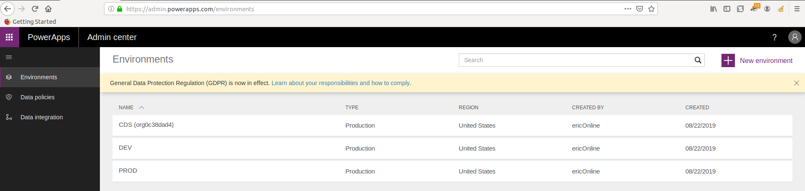
        - **NOTE:** There are multiple ways in which CDS is *auto-provisioned* for an Environment
            - If any user creates a Model-driven app
            - If any user creates a Flow with Approvals
            - If an admin user creates an environment and selects "Create database"
            - etc.
        - If you do not have a CDS-enabled environment, perform the following:
            - Existing environment:
                - Select the environment
                - Click `Create my database`
            - New environment:
                - Click `New environment`
                - Click `Create`
                - When prompted, click `Create database`
                - 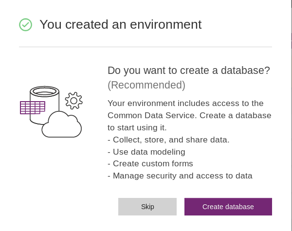
        - The environment will take a few minutes to be provisioned
    - **Method 2**: Use Flow
        - Go to `flow.microsoft.com`
        - Setup the following three steps
            - 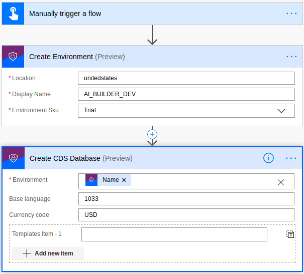
            - Trigger: `Button`
            - Action1: `PowerPlatform for Admins`: Create Environment
                - Location: `unitedstates`
            - Action2: `PowerPlatform for Admins`: Create CDS Database
                - Base language: `1033` (English)
                - Currency: `USD` (US Dollar)

#### Create CDS Entity of Object Names

Object Detection entity only requires two columsn; `ID` and `Name`. These could be named anything you choose.

- Navigate to `make.powerapps.com`
- Click `Data` then `Entities`
- Click `New entity`
- Enter a Display Name: `ObjectDetector`
- A "Plural Display Name" and "Name" will be automatically created
- Click `Create`
- The entity has now been created
- Click `Get data`
- Click `Blank Table`
    - 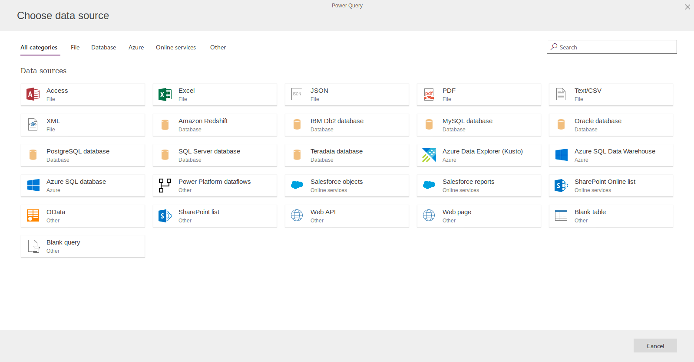
- Setup the Entity then click `Next`
    - Double click on the header and change it to "Name"
    - Enter the names of the people you will capture faces for
    - Right click on the header and choose "Insert"
    - Double click on the new header and change it to "ID"
    - Enter ID numbers for the people you will capture faces for
    - 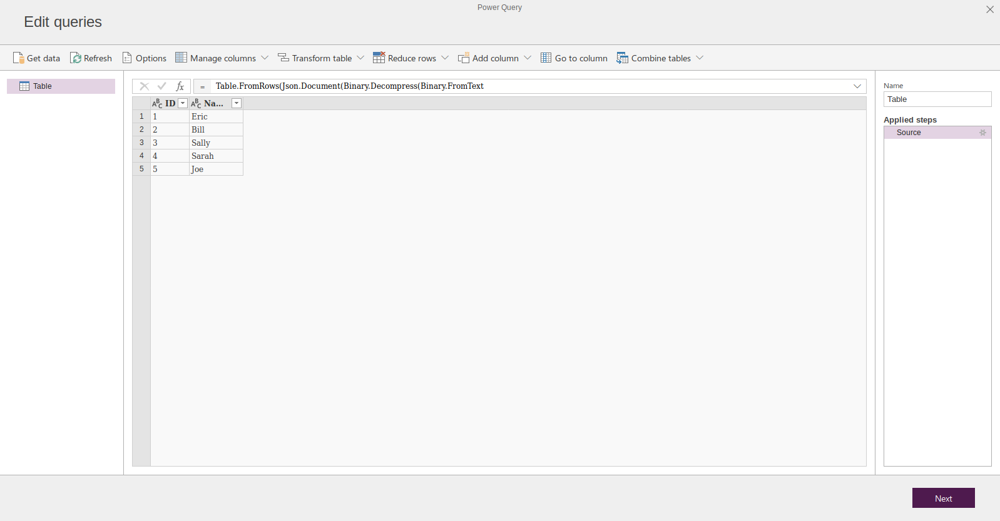
    - Click `Next`
    - Select `Load into new entity`
    - Enter the entity name `Meetup_Obj_Det` (or the like)
    - Copy this name to "Entity display name" field
    - Setup the keys and such accordingly:
        - 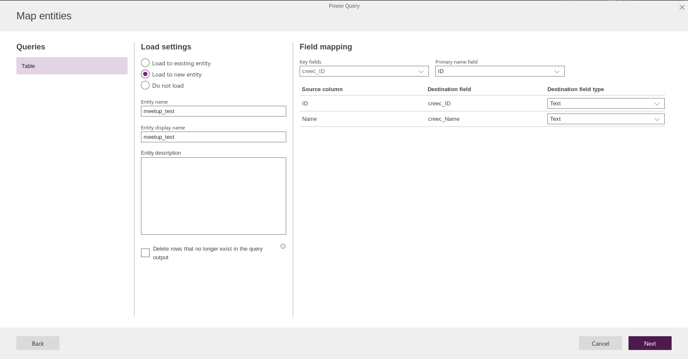
    - Click `Next`
    - Select `Refresh manually` then click `Create`
    - It will take a few minutes for the entity to be created
    - Click `Done`

#### Train Object Detection Model

- Open PowerApps via `make.powerapps.com`
- Click `AI Builder` then `Models`
- Click `Build a model`
- Select `Object Detection`
- Name the model and click `Create`
- Click `Select object names`
- Type in `ObjectDetector` and select the entity
- Select the `Name` field then click `Select field`
- Click `Select all` then `Next`
    - 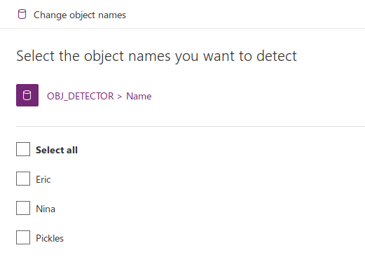
- Click `Add images`
- Select all images to train your model then click `Upload images`
- Click `Close` then `Next`
- Select the first image in the gallery
- Draw a bounding box around the object you wish to detect. Try to keep it tight.
- Select the `Name` from the entity you created earlier to "tag" the image
    - 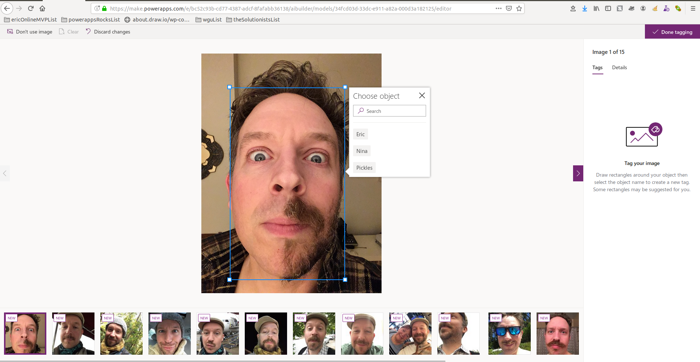
- Click the `right` arrow to move to the next image
- Click `Done tagging` once complete
- 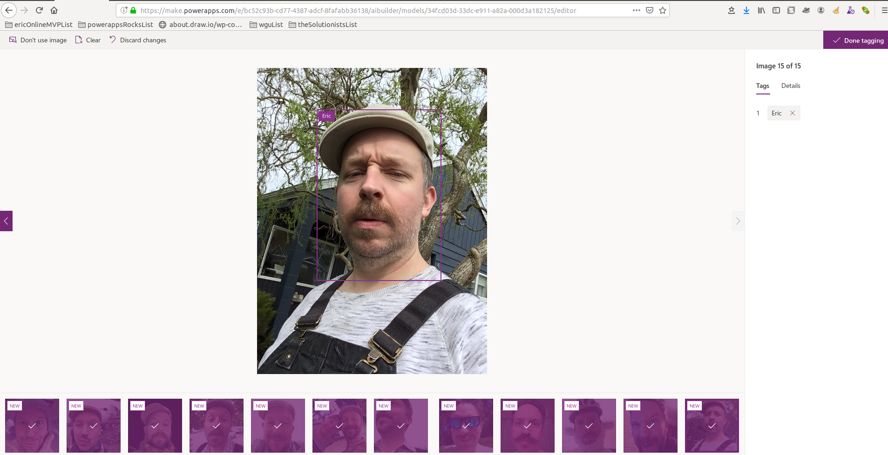
- **NOTE:** You must tag at least 15 images of each value before proceeding. You can click `Save and close` at any time to save progress
    - 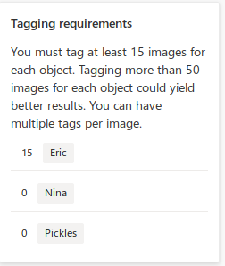
- Click `Train` then `Go to models`. The AI will analyze all the images as you tagged them and identify patterns.
    - The model will show as "training" until complete
    - 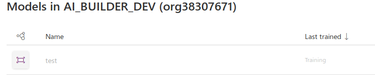
- Once complete, click the model name and view the confidence scores
    - 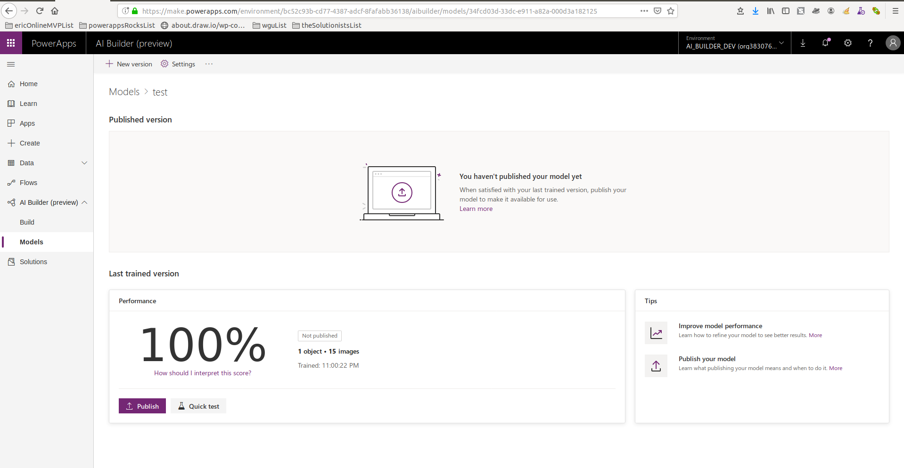
    - Click `Publish`
- Once the model is published, its available in PowerApps!

#### Add Object Detection to a PowerApp

- Visit `make.powerapps.com`
- Click `Apps` then `Create an app` then `Canvas app`
- Select `Tablet layout` for this exercise
- Click `Insert` then `AI Builder` then `Object Detector`
    - 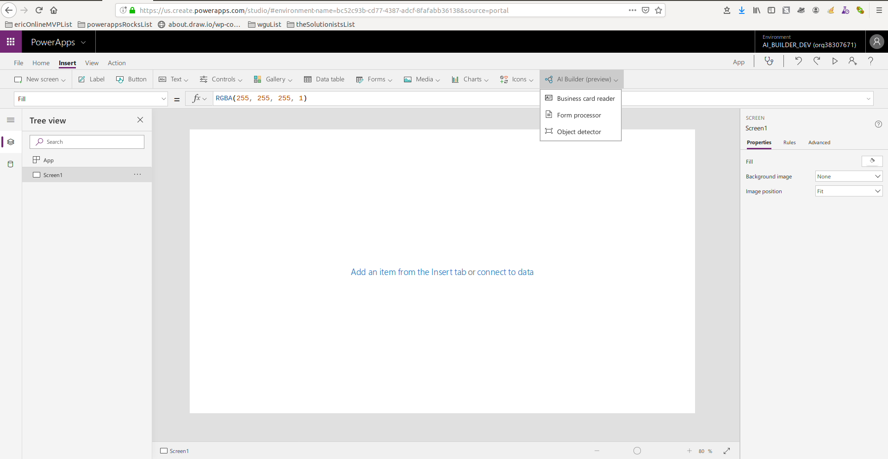
- All possible **published** Object Detection models will show for selection
    - 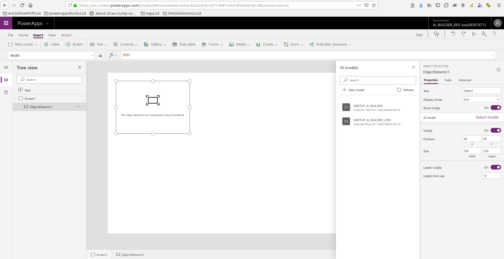
    - Select the correct one
- Click the preview button (top right "Play" button)
- Click `Detect` on the Object Detector
- If on Desktop, select an image that corresponds with what you trained the AI model on
- If on Phone, select or take a photo
- See if the AI finds the correct face
    - 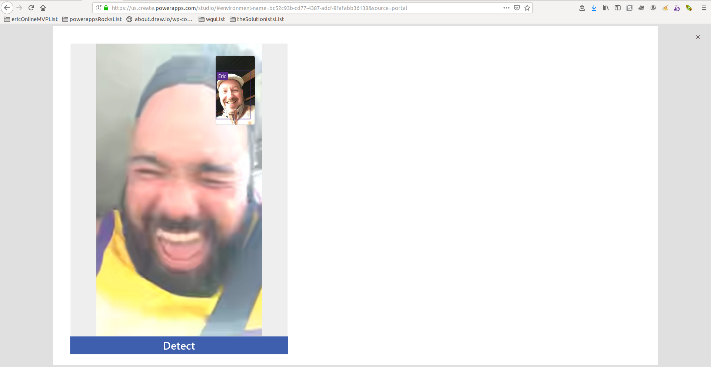
- Build the app UI accordingly knowing that `ObjectDetector1.VisionObjects` contains the juicy AI details

## Form Processing Exercise

#### Pre-requisites

- [Downlaod and extract the sample forms here](https://github.com/microsoft/PowerApps-Samples/blob/master/ai-builder/labs/AIBuilder_Lab.zip)

#### Setup Form Processing Model

- This AI Builder model does not require CDS
- From `make.powerapps.com`, under `AI builder` click `Build`
- Click `Form Processing`
- 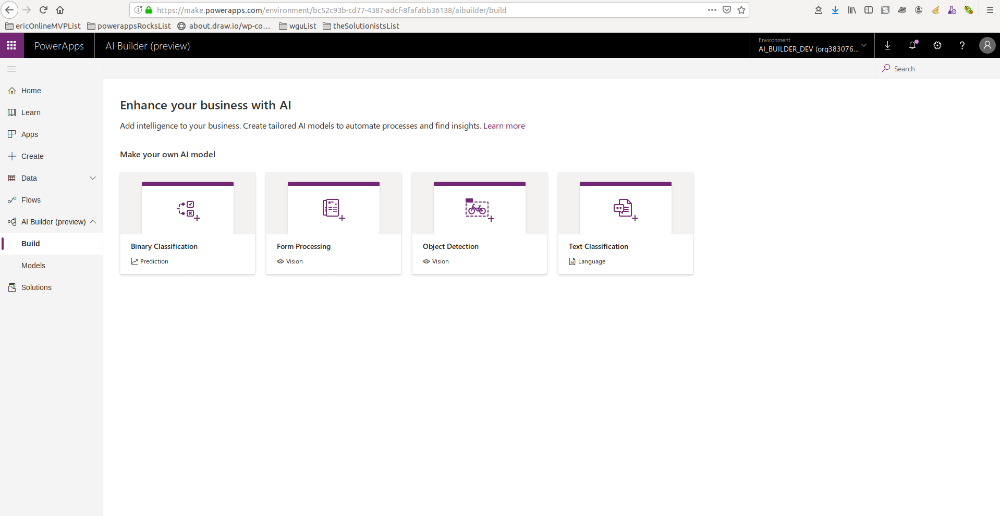
- Name the model then click `Create`
- Click `Add Documents`
- Add the sample documents from above)
- Click `Upload documents`
- Click `Close` then `Analyze`
- Samples of the docs will be analyzed by Azure AI to determine common fields
- Once the analysis completes, click the form icon
- Each dotted line area represents structured data
- If each dotted line area is a valid piece of data to capture, click `Select all` in the top left
- 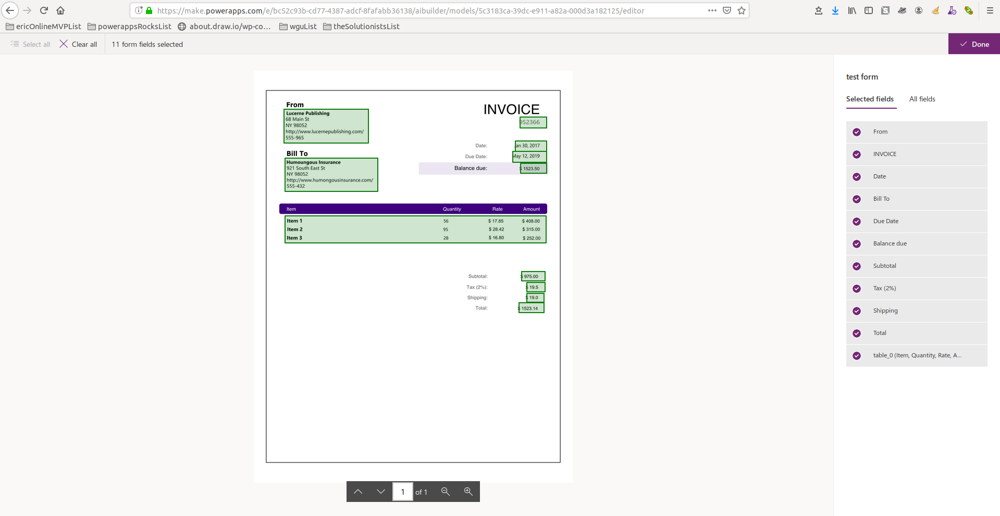
- Individual fields can be unchecked on the right
    - Unfortunately, at this time, there is no way to manually adjust the dotted line bounding boxes
- Click `Done`, then `Next`, then `Train`
- Click `Go to models`
- Once the analysis completes, click the model name then `Publish` to make the model available to PowerApps
    - 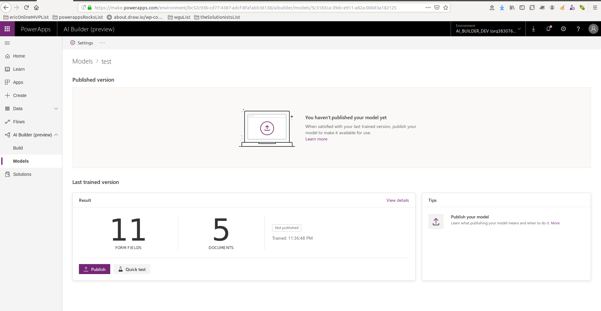

#### Add Form Processing to a PowerApp

- Visit `make.powerapps.com`
- Click `Apps` then `Create an app` then `Canvas app`
- Select `Tablet layout` for this exercise
- Click `Insert` then `AI Builder` then `Form Processing`
- All possible **published** Form Processing models will show for selection
    - 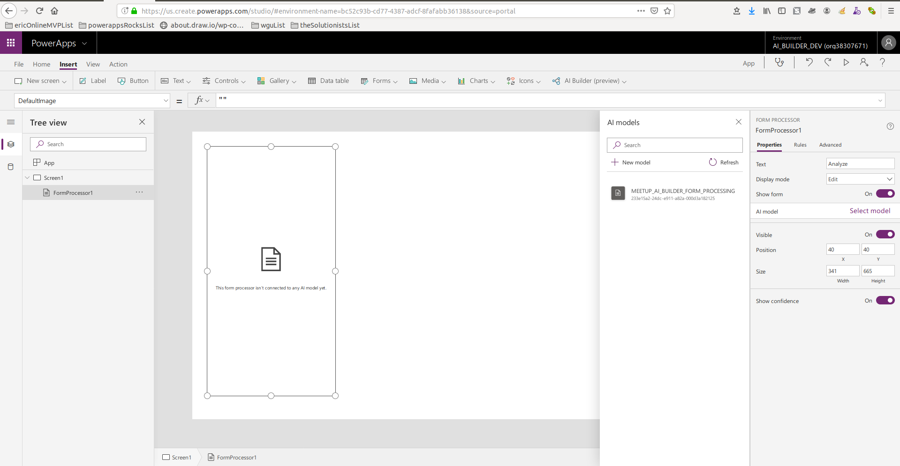
    - Select the correct one
- Click `Insert` then `Form` then `Edit form`
- Select the `FormProcessor1` control
- Set the `OnChange` property to `ClearCollect(colFormProperties, FormProcessor1.FormContent); NewForm(Form1)`
- Set `Form1`'s `Item` property to `colFormProperties`
- Click the preview button (top right "Play" button)
- Click `Analyze` on the Form Processor
- If on Desktop, select a form that corresponds with what you trained the AI model on
- If on Phone, select a form or take a photo of the form
- Build out the form fields according to `colFormProperties`
- Create a Sharepoint List with columns corresponding to `colFormProperties`
- Add a button to the PowerApp
- Set the button's `OnSelect` property to `SubmitForm(Form1)`

### Resources

- [AI Builder Overview](https://docs.microsoft.com/en-us/ai-builder/overview)
- [AI Builder Samples](https://github.com/microsoft/PowerApps-Samples)