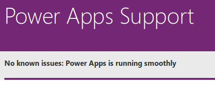
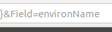
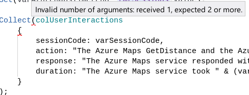
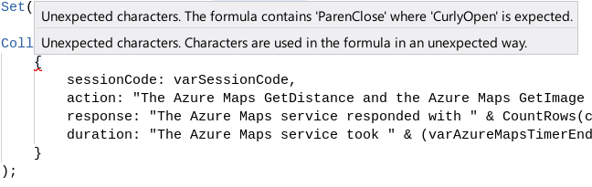

# Meetup #12

## Debugging, Troubleshooting and Supporting PowerApps

- **Time:** Sat Nov 30 11:00-2:00 PDT 2019
- **Venue:** [Ballard Library 5614 22nd Ave. N.W., Seattle, WA 98107](https://www.google.com/maps/place/5614+22nd+Ave+NW,+Seattle,+WA+98107)
- **To contribute energy:**

  - [Venmo](https://venmo.com/powerappsrocks)
      - 
  - [Patreon](https://patreon.com/powerappsrocks)
      - 

## Introduction

As the PowerPlatform continues to grow in capabilities and adoption continues to increase (exponentially!), so does the need for support; both for app *makers* and app *users*. This event will focus on:

1. **Preventing** downstream impacts through thoughtful **design**, **development** and **deployment**
2. **Mitigating** issues quickly through problem isolation, definition and debugging

We'll cover the PowerPlatforms **built-in diagnostic tooling**, **battle-tested enterprise approaches** and **community-based resources** for building high performing apps.

### Goals for this exercise

1. Understand the downstream (support) impacts of PowerApps design decisions
2. Utilize at least 3 PowerApps built-in diagnostic tools
3. Apply at least 3 PowerApps debugging and isolation techniques
5. Identify at least 3 self-service resources for getting support

### Pre-requisites

If you do not have access to one of the licenses below, your instructor can provision you a temporary account to follow along.

- A [PowerApps trial](https://docs.microsoft.com/en-us/powerapps/maker/signup-for-powerapps) (free, requires a non-personal (work/school) email address)
- A [PowerApps Community Plan](https://powerapps.microsoft.com/en-us/communityplan/) (free)
- A [qualifying Microsoft Office account](https://go.microsoft.com/fwlink/?LinkId=2085130&clcid=0x409) (see Appendix D) ($5-12.50/month)
- A [standalone PowerApps license](https://powerapps.microsoft.com/en-us/pricing/) ($15-40/month)
- An [O365 Developer Plan](https://developer.microsoft.com/en-us/office/dev-program) (free, expires after 90 days)
- A [qualifying Dynamics account](https://docs.microsoft.com/en-us/power-platform/admin/powerapps-flow-licensing-faq#dynamics-365)

## Some critical questions to answer during design, development and deployment of Power Apps

See the [Resources](#resources) section for more.

### Design

- **[Extensibility](https://en.wikipedia.org/wiki/Extensibility)**:
	- Has a licensing review been performed for core requirements?
	- Have [Dynamic Azure AD Security Groups](https://docs.microsoft.com/en-us/azure/active-directory/users-groups-roles/groups-dynamic-membership) been established for the user base?
- **Self-service:**
	- Is this app/automation designed for self-service or are developers required for all changes?
	- Have business "superusers" been identified and trained to make changes and provide basic support?
- **Support:**
	- Who will support this app/automation? Maker? Dedicated team/help desk? Other?
	- Are there opportunities for [custom error handling](https://myignite.techcommunity.microsoft.com/sessions/78935?source=SessionDeck) within the app?
	- What is the support ticketing system to be used?
	- Do users have a clear path for reporting issues? Integrated?
	- How far removed is the app maker from this user feedback?
	- Is this the app maker's first (second or even third) app? Who will mentor/monitor/assist?
- **Other:**
	- Is this app focused on [User-centered Design](https://en.wikipedia.org/wiki/User-centered_design) principles?
	- Plenty of tooltips, info buttons, in-context resources
	- Will end user training/reference material be created?

### Development

- Are naming conventions documented and implemented?
- Is code documentation present and clearly written (for each complex statement in the app)?
- Are appropriate debugging controls present and visible to admins?

### Deployment

- Has the app been shared with at least one other "co-owner"?
- Has the co-owner had a walkthrough prior to going live?
- Have real users tested this application and provided structured feedback?
- Has the high priority feedback been integrated?
- What is the communication plan for releasing the app?
- Is there an acceptance criteria for production deployment?
- Is there a documented path for production deployment?

## Some Universal PowerApps Troubleshooting Steps

- **Step 1: Get the issue and app details**
    - Get basic **issue** info
        - User name and contact info
    		- Date and time issue occurred
    		- User location when issue occurred
    		- Device used (mobile or desktop browser)
    		- Description of issue; steps to reproduce
    		- Error message(s)
    		- Screenshot(s)
    		- Ideally, screenshare with the user and have them show you exactly what is going on
    - Get basic **app** info
        - App name and environment name
    		- App maker(s) name and contact info
		- Ideally, automate all of this *within* the app itself. You want a tight user-to-maker feedback loop.

- **Step 2: Is the issue permission-related?**
    - Permission issues account for a significant number of support requests.
    - They often occur when an app is first released, new app users are on-boarded, new functionality is added, etc.
		- Ensure the user in question has correct permissions for the app, connector and data sources as each is unique.
		- Know the minimum permission level for each type of asset and who controls these assets.
		  - **Examples:**
				- SQL requires `db_datareader` and `db_datawriter`. Who is the DBA for this data source?
				- Sharepoint requires `contribute` permission. Who is the Sharepoint admin?
				- Custom Connectors may require `Edit and Share` along with an `api key` or other credential entered by the user or stored in the app.
		- Ideally, automate all PowerApp and Sharepoint permissions *within* the app itself, preferably using "admin" screen and dedicated powerusers.

- **Step 3: Reproduce the issue in DEV**
    - Check to see if the current DEV version = the current PROD version
			- It can be very difficult to determine what, if anything, has changed between DEV and PROD.
			- Consider voting for this [Idea](https://powerusers.microsoft.com/t5/Power-Apps-Ideas/SAVE-VISIBILITY/idi-p/296429#M26511)
    - **Critical**: Don't start off troubleshooting in PROD.
  - Come out of this step with a category for the issue:
    - Data Source-related
		- Connector-related
		- Permission-related
		- Unknown

- **Step 3a: Triage unknown issues**
  - Is this the only app in the org affected?
	- Are similar issues being reported in the [PowerApps Community](https://powerusers.microsoft.com/t5/Building-Power-Apps-Formerly/bd-p/PowerAppsForum1)?
		- 
		- If not, use the search box within the community to find similar error messages.
		- If no similar issues surface, post your issue to the community with screenshots (redacted if needed).
- Is there an outage notice at [support.powerapps.com](https://powerapps.microsoft.com/en-us/support/)?
		- 

- **Step 4: Isolate and address in DEV**
    - Try and isolate the issue to a screen, an action, and finally the culprit piece of code
		- Review the code `OnStart`, `OnVisible`, `OnHidden` `OnSelect`, `OnChange`, `OnSelect` and any other action-related control property.
		- Comment out suspect code and rerun the app
		- Break complex code into sub components. Sometimes spreading them out to different controls.
			- **Example**:
			  - Date and time functions can be notoriously verbose. Putting part of the code in a text box (txtUTCConvert) then calling that textbox from within the other code can help isolate.
		- Check data types are as expected
		- Check Sharepoint *internal* column names
		  - `List Settings`, click column, look in the url at the `Field=`
			- 
		- "Walk the squiggly line"
		  - Hover your cursor at each word in the error message.
			- 
			- Look for double red lines
			- Watch for message changes. This usually indicates either proximity to the issue or the actual problem syntax itself.
			- 

- **Step 5: Document and push changes to PROD**
    - Once a problem has been fixed and tested in DEV, close the loop.
		- Iterate your version number
		- Add notes to the change log
		- Add resolution notes and screenshots to Community Post/Github Issue/ticketing system
		- Notify your user(s) of issue resolution (and thank them for reporting)
		- Export app from DEV
		- Import to PROD

- **Step 5a: Unresolved issues**
    - If an issue cannot be resolved, open an official support ticket with the [Microsoft PowerApps team](https://powerapps.microsoft.com/en-us/support/pro/)
		- This may need to be done by the PowerApps environment admin via the admin portal
		- For fastest resolution, have all troubleshooting documentation prepared and clearly laid out.

## Resources

- [PowerApps Canvas app coding standards and guidelines](https://pahandsonlab.blob.core.windows.net/documents/PowerApps%20canvas%20app%20coding%20standards%20and%20guidelines.pdf)
- 