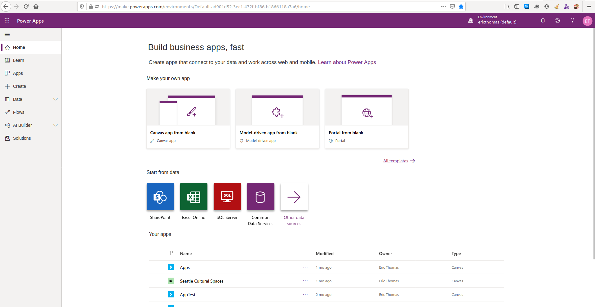
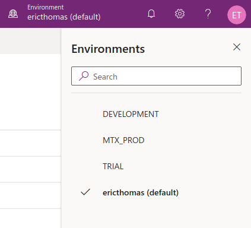
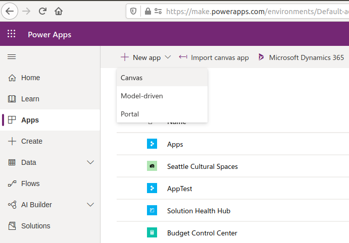
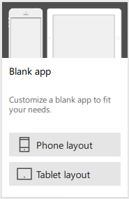

# Meetup #14
## PowerApps for Absolute Beginners

- **Time:** Sat Feb 08 11:00-1:00 PDT 2020
- **Venue:** [Delridge Library 5423 Delridge Way SW Seattle, WA 98106](https://www.google.com/maps/search/?api=1&query=Delridge+Branch+-+The+Seattle+Public+Library%2C+5423+Delridge+Way+SW%2C+Seattle%2C+WA%2C+98106%2C+us&query_place_id=ChIJ3aIMp6lBkFQRoIT0hrJlwwk)
- **To contribute energy:**
  - [Venmo](https://venmo.com/powerappsrocks)
      - 
  - [Patreon](https://patreon.com/powerappsrocks)
      - 

## Introduction

This class will introduce you to [PowerApps](https://powerapps.microsoft.com/en-us/), the low-code, app development leg of Microsoft's [PowerPlatform](https://powerplatform.microsoft.com/en-us/) (PowerApps, [Power Automate](https://us.flow.microsoft.com/en-us/), [PowerBI](https://powerbi.microsoft.com/en-us/)). PowerApps  integrates *natively* with the other PowerPlatform tools, Microsoft Office365 and some Azure services. It can also be extended to connect to nearly any database, filesystem or interface, whether on-premise or in the cloud.

## Goals for this class

You should come away with:

- The ability to explain to the uninitiated what PowerApps is
- A clear picture of the PowerApps infrastructure
- An understanding of the pro's and con's of using PowerApps within your org
- Your first app deployed to desktop, iDevice and Android!

## What is PowerApps?

"PowerApps" is actually a simplified term for an entire suite of integrated components.

**These components include:**

- **An [Integrated Development Environment (IDE)](https://en.wikipedia.org/wiki/Integrated_development_environment)** known as "the editor" or "the Studio"
    - This is where you build the User Interfaces (UI) for your apps. You'll write the code and make connections to data sources using this IDE.
		- Web-based, meaning you code your apps using your web browser
    - Hosted by Microsoft, meaning you don't need to install anything to get started
- **A browser-based app *player***
    - This is how your app users, on laptops and desktops, access any apps you have created and shared with them.
    - You share the URL for your completed app, user visits the URL and interacts with your app.
		- The player works with Chrome, Edge and Firefox
- **An iPhone container app**
    - This is how your app users, on iDevices, access any apps you have created and shared with them.
		- This container app is available in the Apple AppStore
- **An Android container app**
    - This is how your app users, on Android devices, access any apps you have created and shared with them.
		- This container app is available in the Google Play Store
- **Over 200 out-of-the-box API Wrappers known as "Connectors"**
    - These allow you to connect to to popular web services such as Twitter, Dropbox, SQL, etc. with little to no configuration required.
		- Also includes the ability to create Custom Connectors
- **Integrated security based on Active Directory (AD) authentication**
    - For the most part, only people within your organization (those with an "@yourOrg.com" email address) can access applications you have developed.
		- There is a way to allow external users, with their own active PowerApps license to access your apps, but it requires coordination with your security team.

## Why is PowerApps cool?

PowerApps rocks because it enables technically-minded, curious people to create value quickly for their organization. Its also a springboard into technical learning. Want to know about API's? Curious about databases? Excited by User Experience and User-Centered Design? PowerApps gives you an approachable way to start interacting with what were previously very technical concepts.

PowerApps represents the fastest way to get from idea to action, across your organization.

## What are some pros/cons of PowerApps?

**Pros:**

- No app infrastructure to setup, maintain, support
- Rapid developer setup
- Rapid iteration
- Rapid deployment
- Device agnostic
- Network agnostic
- Online/Offline capable
- Responsive capable
- Handles photos and QR codes well
- Can use device sensors (Lat/Long/Altitude)
- Integrates with MANY systems right out-of-the-box (Connectors)
- Built-in (basic) versioning
- Code components can be reused across your org
- VERY extensible
- VERY vibrant community of people willing to help

**Cons:**

- Licensing costs add complexity (and could change in the future)
- Because the PowerApps infrastructure is completely hosted by Microsoft, you must open a support ticket when issues/bugs arise that you cannot fix
- Must be connected to the internet to develop apps
- If support and governance infrastructure within your org does not exist, the PowerPlatform can "run wild"
- "IT" might be threatened / intimidated / upset / try to shut you down
- Not easy to share PowerApps with people outside your organization
- Ready for mission-critical applications? [link1](https://powerusers.microsoft.com/t5/Building-Power-Apps/Is-PowerApps-ready-for-Mission-Critical-Applications/m-p/122664#M43193), [link2](https://powerusers.microsoft.com/t5/Building-Power-Apps/MISSION-CRITICAL-Is-PowerApps-ready/td-p/181642/highlight/false)
- PowerApps is really good at getting you 80% of the way to a solution; the last 20% usually require a specialist
- A lot of tedium to rename controls and maintain best practices

## How to get PowerApping

**Step 1: Get an organizational email address**

There are two entry points to begin working with PowerApps:

1. As an employee of an existing organization (bob@bigOrg.com)
2. By creating your own organization (bob@myOrg.com)

The key to using the PowerPlatform is your email address. This is due to the fundamental security advantage of Active Directory (AD). If someone is not part of your organization (they do not have an @yourOrg.com email address), they cannot ([easily*](https://powerapps.microsoft.com/en-us/blog/share-canvas-apps-with-guests-in-your-organization/)) use PowerApps created by you.
PowerApps does not respect Gmail, Yahoo, etc public email addresses. One must be part of an org.

**Note:** Please let your instructor know if you do not have an organizational email address and one will be provided to you for the duration of this class.

**Step 2: Visit `make.powerapps.com`**

- This is the default website to begin your PowerApps journey. It hosts the IDE.
- `create.powerapps.com`, which was the original starting point, still houses some specific features, but will likely be deprecated someday
- You should see this:
- 
- To determine how "advanced" your org's PowerApps journey is, click on the `Environments` area to see if additional environments have been created.
		- Each tenant begins with a `default` environment
		- If you see others here, you're likely not the only one working with PowerApps within your org :) !
		- If you see a `DEV` or similar environment, select it
		- 

**Step 3: Click `Apps` then `New app` then `Canvas App`**

- 
- Wait a minute! What are `Model-driven apps` and `Portals`?!?
- You had to ask, didn't you :)
	- `Model-driven` apps are PowerApps created for Microsoft's Customer Relationship Management (CRM) tool [Dynamics365](https://dynamics.microsoft.com/en-us/)
		- To develop Model-driven apps, your org needs to be using Dynamics365 as a CRM tool
		- Model-driven apps are a different beast. We'll focus on Canvas apps for now.
	- [`Portals`](https://docs.microsoft.com/en-us/powerapps/maker/portals/overview) are a newer PowerPlatform addition.
		- Think of a WordPress website, with PowerApps integration, that charges you per person who accesses(?!, I know).
		- They are a recent stab at exposing the PowerPlatform to external users (users outside your @myOrg.com).
		- Portals are a different beast. We'll focus on Canvas apps for now.

**Step 4: Select the form factor for your application; Phone or Tablet.**

- PowerApps come in two form factors, mobile phone (portrait) and tablet (horizontal)
- This are not necessarily static form factors.
	- You can build apps that adapt themselves to any screen they are played on. 
	- See [Meetup #9 Building Responsive, Reusable Components](https://github.com/SeaDude/seattlePowerAppers/blob/master/outlines/responsiveApps.md).
- For our purposes, **select Tablet Layout**.
	- 
- PowerApps will spin up the IDE and you'll be ready to rock!
- **Note:** At a *later date*, when you are feeling more comfortable with the toolset, visit some of the templates shown on this screen to see how others code their apps.

**Step 5: Start apping!**

## PowerApps Editor

There are 4 concepts you need to be absolutely comfortable with. Study these terms if you want to become a true PowerApper (Seattle or otherwise :) ).

- Controls
- Properties
- Functions
- Connectors

### Controls

[Controls](https://docs.microsoft.com/en-us/powerapps/maker/canvas-apps/reference-properties) represent the interactive parts of your application. PowerApps has MANY controls you can just click and drag onto your canvas; buttons, dropdown boxes, check boxes, radio buttons, list boxes, galleries, etc.

These are the elements your user engages with.

### Properties

Each control has a BUNCH of properties you can define. There are two main types of properties; those that **describe** the control (text, width, height, fill color, ect) and those that create an **action** from the user interacting with the control (OnSelect, OnChange, etc.)

You will write many of your functions on **action** properties.

### Functions

[Functions](https://docs.microsoft.com/en-us/powerapps/maker/canvas-apps/formula-reference) are the "low-code" piece of the puzzle. These are the Excel-like formulas you write to control the logic and functionality of your app. 
- When a user clicks a button, set a variable.
- When a user selects `a` from a dropdown box, do `x`, when they select `b`, do `y`.
- When the app loads, get data from a SQL Table

### Connectors

[Connectors](https://docs.microsoft.com/en-us/connectors/) are the backbone of PowerApps. They enable you to connect to over 200 data sources (Sharepoint, SQL, Outlook, Planner, etc.) with little configuration. If you need to connect to a data source that is not part of the 200+ out-of-the-box connectors, you can create a [Custom Connector](https://docs.microsoft.com/en-us/connectors/custom-connectors/define-blank).

Connectors may or may not leverage the [On-Prem Data Gateway](https://docs.microsoft.com/en-us/powerapps/maker/canvas-apps/gateway-reference) to access databases hosted within your company firewall.

**Note:** Accessing On-prem data with PowerApps is a premium feature.

## Developing your first PowerApp

Hands on demo!!

Import the Sample App into your PowerApps environment

1. Download the Sample App [here](https://github.com/SeaDude/seattlePowerAppers/raw/master/apps/powerappsForAbsoluteBeginners.msapp)
2. Visit `create.powerapps.com`
3. Click `Open` then `Browse` and select the Sample App you downloaded
4. Click `Allow` on all connections

## Publishing your first PowerApp

Publishing to desktop, iDevices and Android is dead simple*.

1. Save your app
	- Click `File` then `Save`
	- Name your app accordingly
2. Click `Share`
	- Select people within your org to share the app with
	- If you share it with no one, only you will be able to access
3. Click `Publish`

***CRITICAL NOTE:**

- If your app utilizes premium connectors (marked with a diamond icon) or on-premise data, **all of your users** will require a [premium license](https://powerapps.microsoft.com/en-us/pricing/).

- Users can be licensed in one of two ways:
- Per-app license
	- $10/app/user/month
- Per-user license
	- $40/user/month
	- Unlimited premium PowerApps

The obvious tipping point is when a user interacts with 4 or more premium PowerApps.