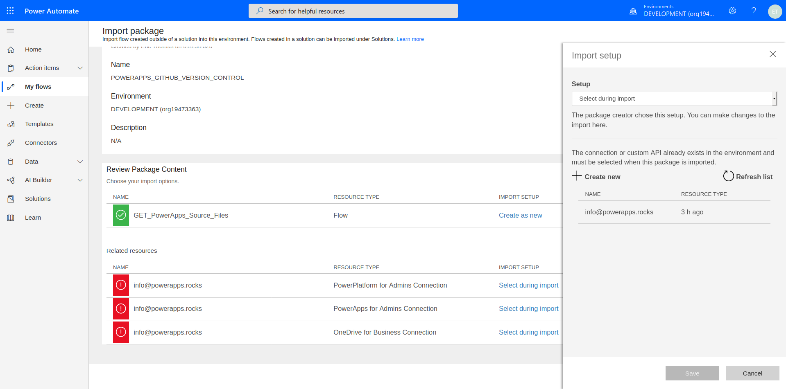
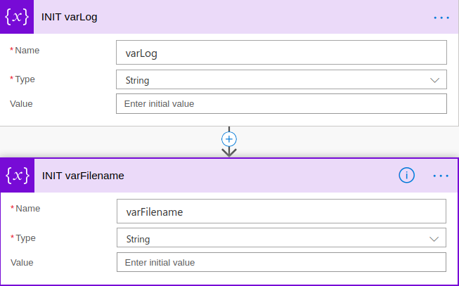
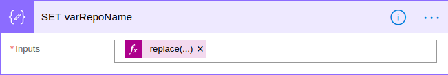
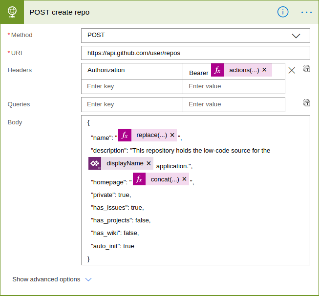

# Meetup #13

## PowerApps Version Control Using Github

- **Time:** Sat Jan 25 11:00-2:00 PDT 2020
- **Venue:** [Southwest Library 9010 35th Ave SW, Seattle, WA 98126](https://www.google.com/maps/place/Southwest+Branch+-+The+Seattle+Public+Library/@47.5225296,-122.378476,17z/data=!3m1!4b1!4m5!3m4!1s0x5490415b59cb97e7:0xa0c0abe7087c7248!8m2!3d47.5225296!4d-122.3762873)
- **To contribute energy:**
  - [Venmo](https://venmo.com/powerappsrocks)
      - 
  - [Patreon](https://patreon.com/powerappsrocks)
      - 

## Introduction

One of the missing elements of PowerApps development is the ability to see changes that have been made between saves and published versions. Someday it may become available, but in the meantime, we can build it ourselves using Power Automate and Github!

**Some of the benefits of this approach include:**

- Visualizing the differences in code between app versions
- Pinpoint exactly where an app changed
- Always have a backup in case user deletes an app
- DevOps engagement

## Pre-requisites

- [Create a Github account](https://github.com/join)
- Github Personal Access Token
  - Used to read/write to your private repositories using the Github API
- Power Automate premium license (to use the HTTP Action)

## Goals for this exercise

By the end of this class, attendees should:

- Have an understanding of advanced Power Automate best practices including
	- How to "hide" API keys
	- How to in-line document Flows
	- How to debug Flow failures
- Be able to call any REST service using the HTTP Action
- Have a thorough understanding of advanced features
- Have a good understanding of Github API

## Instructions

1. **Generate a Github Personal Access Token (PAT)**
	- Go to your [Github Settings](https://github.com/settings/profile)
	- Login as necessary
	- Click `Developer Settings` near the bottom
	- Click `Personal Access Token` then `Generate New Token`
	- Name the token `MS_FLOW_DEV`
	- **IMPORTANT**
			- Check the `repo` and `delete repo` permission boxes
			- 
	- Click `Generate Token`
	- **CRITICAL**
			- Copy and paste this token _somewhere smart_; you'll need it later
			- There is only one chance to copy this token
			- Ideally, put the token in your password manager (KeyPass or the like)

2. **Download the [sample Flow](https://github.com/SeaDude/seattlePowerAppers/raw/master/flows/POWERAPPS_GITHUB_VERSION_CONTROL.zip) from the Seattle PowerAppers Github repo**

3. **Import the Flow to your tenant environment**
- Go to `https://flow.microsft.com` and login
- Click `My Flows` then `Import`
- Select the sample Flow `.zip` file downloaded previously and click `Upload`
- Name the flow accordingly
- Create the 3 required connections (PowerPlatform for Admins, PowerApps for Admins, OneDrive for Business) as follows:
  - Under `Related resources`, click `Select during import`
	- Either click your email address, **OR** `Create new`
	    - 
	    - If `Create new`, once the connection page loads, click `New Connection` and select/search for and select the appropriate connector
  - Repeat until there are gray "x" 's for each connection then click `Import`
	- 

4. **Lets dissect the Flow BEFORE running it (please :) )**

- `Trigger`: 
		- **Type**: Recurrance
		- This flow runs every day at 3:00AM
		- 
- `DOCS`: 
		- **Type**: Compose
		- Used to capture notes about the flow for anyone who inherits it
		- 
- `SECRETS`
		- **Type**: Compose
		- Used to store the Github Personal Access Token.
		- Click the three dots, then `Settings` then paste in your PAT as a Tracked Property
		- **Inspiration**: [John Liu's blog post](https://johnliu.net/blog/2018/10/hiding-your-microsoft-flow-valuables-i-mean-variables-out-of-sight)
		- **Note**: This only hides your PAT from visual inspection. The PAT is present in any export of the flow and also can be viewed by anyone with edit access. See [my community post here](https://powerusers.microsoft.com/t5/Building-Flows/BEST-PRACTICES-How-to-Protect-Secrets-in-Power-Automate/m-p/430981) for deeper discussion.
		- 
- `INIT var's`
		- **Type**: Initialize Variable
		- All variables must be initialized outside of `For Each` loops. Good practice to do this near the beginning of the flow
		- 
- `GET environment as admin`
		- **Type**: PowerPlatform for Admins
		- Gets all details about a given environment. There is also a `Get environment**s** as admin` action which will grab details of all environments.
		- 
- `GET all apps in env`
		- **Type**: PowerApps for Admins
		- Gets details about every app in a given environment.
		- 
- `FOR EACH app`
		- **Type**: Apply to Each (loop)
		- For each app in the environment, do these things.
		- 
- `SET varRepoName`
		- **Type**: Compose
		- **Expression**: `replace(items('FOR_EACH_app')?['properties']?['DisplayName'],' ','-')`
		- Takes any spaces out of the app name and replaces them with a hyphen. Used for naming convention of Github repo.
		_ **Note**: For performance reasons, it is preferred to use Compose actions within Apply to Each loops. Here is an example of how to do that. I've found that its not always possible (append to array/string for example).
		- 
- `GET github repo for app`
		- **Type**: HTTP (premium)
		- This is a GET request sent to the Github API to determine if a repository already exists for the app
		- **Note**: The last part of the request URL is the output from `varRepoName` action
				- **Expression**: `outputs('SET_varRepoName')`
		- **Note**: The `Bearer` token is the Github PAT stored in the `Secrets` Tracked Properties
				- **Expression**: `actions('SECRETS')?['trackedProperties']?['githubAuth']`
		
- `Configure Run After` (CRA) setting
		- Designated by the little `!` icon. 
		- On the `SWITCH on status code` action, click the three dots then `Configure run after` to see selected values
		- 
		- This CRA allows the Switch action to run whether the previous action succeeds *or* fails. This is important as you'll soon see.
- `SWITCH on status code`
		- **Type**: Switch
		- This looks at the status code returned from the Github api call. If its a `200`, do Switch case 1, if its a `404` do Switch case 2. (super hack!)
		- **Expression**: `outputs('GET_github_repo_for_app')['statusCode']`
- Switch case 1: `STATUS 200`
		- `GET last release tag`
				- **Type**: HTTP (premium)
				- Retrieves the last release **tag** applied to the repo's master branch
				- Notice the same path and Bearer are used as the initial Github API call
				- [Github API docs](https://developer.github.com/v3/repos/#list-tags)
				- 
		- `DEBUG compare versions`
				- **Type**: Compose
				- Anything called `DEBUG` is to "peek" at some data. Used for dev purposes. In this case, I wanted to verify the release tags because in the flow run history, this comparison is not visible.
				- **Expression**:`PowerApps appVersion: replace(replace(items('FOR_EACH_app')['properties']['appVersion'],'-',''),':','')`
				`Github releaseVersion: body('GET_last_release_tag')[0]['name']`
				- 
		- `IF appVersion equals releaseVersion`
				- **Type**: Condition
				- Compares the latest version of the PowerApp with the latest release tag in Github
				- **Expression**: Same as `DEBUG` above
				- 
		- `YES` Condition
				- `APPEND to log variable`
				- Written in markdown. Likely will be used for a Teams notification or a Github Issue in the future.
				- 
				- **Expression**:
				`#### Sync job run at: utcNow()`
				`- **App: replace(items('FOR_EACH_app')?['properties']?['displayName'], ' ', '-')**`
				`- Status: No update needed`
				`- PowerApps appVersion:  replace(replace(items('FOR_EACH_app')['properties']['appVersion'],'-',''),':','')`
				`- Gihub releaseVersion:  body('GET_last_release_tag')[0]['name']`
		- `NO` Condition
				- `GET branch`
					- **Type**: HTTP (premium)
					- In order to update files in a Github repo, we first need to get the last commit to the master branch
					- [Github API docs](https://developer.github.com/v3/repos/branches/#get-branch)
					- 
				- `GET tree shas recursively`
					- **Type**: HTTP (premium)
					- The second step to update files in a Github repo is to get each file's "sha" hash from the last commit
					- The `commit.commit...` expression is: `body('GET_branch')?['commit']?['commit']?['tree']?['sha']`
					- 
				- `SELECT each filename and sha`
					- **Type**: Select
					- This is a rather ingenious approach which creates an array of filename and its corresponding sha (hash). We'll use this later in the flow.
					- 
				- `GET source files 2`
					- **Type**: HTTP (premium)
					- Magic sauce! This URL is grabbed from the `Get apps as admin` action. When hit, it responds with a `.zip` file of all the files that make up your PowerApp!
					- Kudos to Audrie Gordon for having [the first YouTube video on this topic](https://www.youtube.com/watch?v=1Tzh_CI4xvo) during her 2019 Power Automate Advent marathon! (Awesome work Audrie!)
					- For the record, I also found this URL way back in ~June 2019 or so (ask Antoinette :))
					- 
				- `CREATE ZIP file in OneDrive`
					- **Type**: OneDrive for Business
					- This action writes the `.zip` file to a OneDrive for Business folder
					- Each file in this `.zip` will be placed under version control in Github
					- 
				- `CREATE MSAPP file in OneDrive`
					- **Type**: OneDrive for Business
					- This action writes the `.msapp` file to a OneDrive for Business folder
					- Because I haven't figured out how to "reassemble" the extracted `.zip` files to a usable `.msapp` file, this is overwritten each time as the `latest.msapp`
					- 
				- `UNZIP source files 2`
					- **Type**: OneDrive for Business
					- Does what it says, unzips the `.zip` file into individual files
					- VERY interesting caveat: If a file is nested into a file, the resulting file name has one or multiple "_" 's.
					- 
				- `LIST FILES in OneDrive folder`
					- **Type**: OneDrive for Business
					- So far, the `.zip` folder, the `.msapp` file and all unzipped source files are in the same OneDrive for Business folder
					- This action *should* list all of them so we can loop through each and commit to the Github repo as appropriate BUT the `List files in folder` action has a flaw... it does not allow dynamic directories.
					- [Further reading can be found here](https://powerusers.microsoft.com/t5/General-Power-Automate/BUG-OneDrive-for-Business-List-Files/m-p/451700#M44933). We use a `Configure run after` setting to work around BUT this limitation results in an additional 4 steps in this flow.
					- 
				- `FOR EACH source file 2`
					- **Type**: Apply to Each (loop)
					- For every *unzipped file* do `x, y, z`. Ideally, we'd like to use the previous step to include the `.msapp` file.
					- 
				- `IF filename starts with an underscore 2`
					- **Type**: Condition
					- Recall that when OneDrive for Business unzips a `.zip` file, if the files are nested, it adds an underscore for each nested level.
						**Example:**
						```
								Folder1
								|--File1.json
						```
						becomes `Folder1_File1.json` as a filename
					- This is actually ok as the Github API allows you to specify a path when uploading or updating a file. The scheme is `Folder1/File1.json` so we could do a simple `replace` to trade the "_" for a "/".
					- If you pass this to the API, it will either *create* `File1` **within a new** `Folder1` as part of the *initial* commit *or* update `File1` within the existing `Folder1` as part of a *subsequent* commit.
					- **Caveat**: You can't start a Github api call with a "/". SO, when we do our `replace`, we need to see if the file starts with an underscore and address accordingly. 
					- SO FAR... this only occurs when an app has a Canvas PCF component (pretty rare)
					- 
				- `GET file content 2`
					- **Type**: OneDrive for Business
					- This action grabs the file content itself
					- 
				- `CONVERT to base64`
					- **Type**: Compose
					- The Github API requires each commit to be in base64 format. Flow has a built-in expression for that.
					- **Expression**: `base64(body('GET_file_content_2'))`
					- 
				- `DEBUG filename`
					- **Type**: Compose
					- This is used to gain visibility on the items being filtered in the next action. Without this DEBUG step, the results are not visible when reviewing runs.
					- 
				- `FILTER ARRAY of github files`
					- **Type**: Filter Array
					- Recall that we are inside a For Each loop at the moment (`FOR EACH source file 2`).
					- This IMPORTANT action filters each cleaned up PowerApps filename (removed leading "_") against the Github filenames in the `SELECT each filename and sha` action
					- This action is used to determine if a file is **NEW** to the sourcefiles or **EXISTING**.
					- 
				- `IF new file`
					- **Type**: Condition
					- Test whether a file is already part of the Github repo or if it is new
					- 
				- `YES` Condition
					- Create a `PUT` request to _add_ the file to the Github repository
					- 
				- `NO` Condition
					- Create a `PUT` request to _update_ the file in the Github repository
					- The key differentiator here being the `sha` that is attached to the `PUT` body
					- 
				- The next 4 actions are required to write the `.msapp` file to the Github repo. They are duplicated from above actions.
					- 
				- `POST add release tag 2`
				  - **Type**: HTTP
					- This is a **CRITICAL** step. This provides the release tag which the `GET release tag` action compares the PowerApps source files to.
- Switch case 2: `Status 404`
  - The `404` case mirrors a lot of the `200` case with the exception of the `POST create repo` action
	- Because the `GET github repo for app` response was basically "Not found", this means that a repo has not yet been created for this app. 
	- This path creates that repo then proceeds to populate it with PowerApps source files as outlined in the `200` path.
	- 
