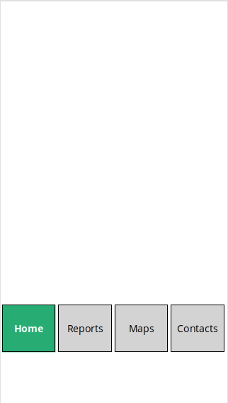
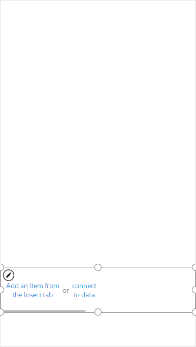

# Build Reusable, Responsive PowerApps Components

- **Time:** Sat Aug 3 11:00-2:00 PDT 2019
- **Venue:** [Broadview Library 12755 Greenwood Ave N, Seattle, WA 98133](https://www.google.com/maps/place/Broadview+Branch+-+The+Seattle+Public+Library/@47.7229573,-122.3582867,17z/data=!3m1!4b1!4m5!3m4!1s0x549016cccabf4b5f:0x507e83e0ae31efa8!8m2!3d47.7229573!4d-122.356098)
- **To contribute energy:**
  - [Venmo](https://venmo.com/powerappsrocks)
  - [Patreon](https://patreon.com/powerappsrocks)

## Introduction

Responsive design is now possible in PowerApps. By using references to device height and width, PowerApps Makers can fit their app to any canvas size. Controls will be placed and sized using *relative or dynamic* values and formulas instead of *static* ones.

### Definitions

- **Responsive:** An application is responsive if it adapts itself to any screen size and landscape/portrait orientation
- **Component:** A screen, control or combination of controls which can be reused across an app or across multiple apps
- **Dynamic:** A value or formula that changes based on another value or formula. This is opposed to "static" values/formulas where values are supplied as part of the code.

### Considerations

- Design to the smallest form factor your users will interact with
  - If users will mostly use an iPhone in portrait orientation, design your app primarily for this form factor
- Once dynamic formulas are created for a controls `X`, `Y`, `Height` and `Width` properties, DO NOT DRAG IT AROUND THE SCREEN.
  - If you do, dynamic formulas will be overwritten with static values

#### Screen-related Properties

- `Design.Height` & `Design.Width`
  - Derived from the dimensions specified in `Screen size + orientation` of `File / App Settings`

- `App.Height` & `App.Width`
  - Correspond to the dimensions of the device or browser window.
  - If the user resizes the browser window (or rotates the device if you've turned off Lock orientation), the values of these properties change dynamically.

#### Control-related Properties

- `X`, `Y`, `Height`, `Width`
  - These must be defined by (mostly) dynamic values or formulas to remain responsive

#### Special Properties

- `Parent.Height` & `Parent.Width`
  - References a **container's** height and width.
  - Containers can be:
    - Screen controls
    - Gallery controls
    - Enhanced Groups
    - Components

### Instructions to build a responsive, reusable screen component

#### Create a new PowerApp

1. Visit `make.powerapps.com`
2. Click `Canvas app from blank`
3. Name the app
4. Choose `phone` layout

#### Adjust app settings

1. Click `File`, `App Settings`, `Screen size + orientation`
2. Turn `Scale to fit` off
3. If you'd like to design an app that allows both landscape and portrait orientations, turn `Lock orientation` off
4. Click `Apply`
5. Click `Advanced settings`
6. Turn on `Components` and `Enable formula bar result view`
7. Click the left arrow within PowerApps (NOT browser back button)
8. Click `CTRL + s` to save app

#### Create the screen component

1. Click `Components` under `Tree View`
2. Click `New component`
3. Rename the component to `cmpRespScreen`
  - Double click the component; rename
4. Set `cmpRespScreen` properties
  - `Width`: `Max(App.Width, If(App.Width < App.Height, App.DesignWidth, App.DesignHeight))`
  - Explanation: Set the **component width** to the larger of:
  - The device width OR,
  - When the device is in portrait orientation, the width in App Settings OR
  - The height in App Settings
  - Substitute "device" for "browser window" when the app is used on laptop
  - `Height`: `Max(App.Height, If(App.Width < App.Height, App.DesignHeight, App.DesignWidth))`
  - Explanation: Set the **component height** to the larger of:
  - The device height OR,
  - When the device is in portrait orientation, the width in App Settings OR
  - The width in App Settings
  - Substitute "device" for "browser window" when the app is used on laptop

#### Create some Custom Properties for `cmpRespScreen`

1. Click `New Custom Property` on the right
2. `Display Name`: `cmpPrimaryColor`
3. `Name`: `cmpPrimaryColor`
4. `Description`: `cmpPrimaryColor`
5. `Property Type`: `Input`
6. `Data Type`: `Text`
7. Click `Create`
8. Repeat the above steps, for another Custom Property called `cmpSecondaryColor`

#### Create a responsive menu control within the component

This is what we're building:


1. Insert a blank horizontal Gallery control to be used as the screen menu
2. Rename it to `glrMenu`
3. Move it near the bottom of the component
  -  
4. Set `glrMenu` Properties:
  - `Y`: `.85 * cmpRespScreen.Height` (Start menu 85% of the way down the component)
  - `X`: `cmpRespScreen.X`
  - `Width`: `cmpRespScreen.Width`
  - `Height`: `.13 * cmpRespScreen.Height`
  - 13% of the component height
  -  Derived by taking the height of the Gallery in *my instance of the app* (146) and dividing it by the component height (1136) = .128
  - `TemplateSize`: `.25 * (Parent.Width - 25)`
  - **NOTE:** The static values here go against the dynamic principals laid out above
  - See the code comments in this property of the sample app for "Levels of responsiveness"
  - `Transition`: `Transition.Pop`
  - `OnSelect`: `Set(varSelectedPage, ThisItem)`
  - `Default`: `{}`
5. Insert a Label control into the Gallery. This will be used to display screen names in the menu.
  - Alternatively, you could use an Image control to display icons in lieu of text.
  - Click the edit (pencil) icon in the Gallery
  - Click Insert, then Label
  - Rename the Label to `lblScreenName`
6. Set `lblScreenName` Properties:
    a. `Y`: `0`
    b. `X`: `0`
    c. `Width`: `Parent.TemplateWidth`
    d. `Height`: `Parent.TemplateHeight`
    e. `Fill`: `If(ThisItem.IsSelected, ColorValue("#27ad74"), ColorValue("#d3d3d3"))`
    f. `FontWeight`: `If(ThisItem.IsSelected, FontWeight.Bold, FontWeight.Normal)`
    g. `Color`: `If(ThisItem.IsSelected, ColorValue(cmpRespScreen.cmpPrimaryColor), ColorValue(cmpRespScreen.cmpSecondaryColor))`
    h. `Align`: `Align.Center`
    i. `Size`: `Parent.Height / 6`
    j. **Note:** This is largely arbitrary. You can create a proportion based on your own liking.
7. Create a Custom Property for the Component
    a. Select the component in Tree View
    b. Click `New Custom Property` on the right
    c. `Display Name`: `cmpMenuItems`
    d. `Name`: `cmpMenuItems`
    e. `Description`: `cmpMenuItems`
    f. `Property Type`: `Input`
    g. `Data Type`: `Table`
    h. Click `Create`
    i. Select the Property dropdown box for the Component then select `cmpMenuItems`
    j. Set its value to `Table({screen: "SampleText"})`
    k. This is just a placeholder table
    l. When this component is brought into an app, we'll populate this with actual screen names
8. Set the `glrMenu` Items property to `cmpRespScreen.cmpMenuItems`
9. Set the `lblScreenName` Text property to `ThisItem.screen`
10. Click `CTRL + s` to save app

#### Add `cmpRespScreen` to an app

1. Click `Screens` in the Tree View
2. Click `App`
3. To the `OnStart` property, add:
```
//
// We won't use "icon". You could use this if you had icons stored in a database somewhere.
//
ClearCollect(
    colMenuItems,
    {screen: "Home", icon: ""},
    {screen: "Reports", icon: ""},
    {screen: "Maps", icon: ""},
    {screen: "Contacts", icon: ""}
)
```
4. Click the three dots on `App` then `Run OnStart`. `colMenuItems` should now be created.
5. Rename `Screen1` to `scrHome`
6. Click `Insert` then `Component`
7. Select `cmpRespScreen`
8. The component will be inserted as `cmpRespScreen_1`
9. With `cmpRespScreen_1` selected, select `cmpMenuItems` from the properties dropdown
10. Set it to `colMenuItems`
11. Click `CTRL + s` to save app
12. Put the app in Preview Mode
13. Click through the menu and revel in what you've accomplished!

#### Create a responsive logo image within `cmpRespScreen`

1. Click `Components` from Tree View
2. With `cmpRespScreen` selected in Tree View, click `New Custom Property`
3. `Display Name`: `cmpLogo`
4. `Name`: `cmpLogo`
5. `Description`: `cmpLogo`
6. `Property Type`: `Input`
7. `Data Type`: `Image`
8. Click `Create`
9. Click `Insert`, `Media`, `Image`
10. Place the Image control in the top left corner of the app screen, resize as necessary
11. Rename it to `imgLogo`
12. Set `imgLogo` properties
    a. `Image`: `cmpRespScreen.cmpLogo`
    b. `X`: 0
    c. `Y`: 0
    d. `Width`: `.34 * Parent.Width`
        i. Derived from dividing the width of the logo in my instance of the app (218) by the width of the component (640) and rounding
    e. `Height`: `.10 * Parent.Height`
        i. Derived from dividing the height of the logo in my instance of the app (123) by the height of the component (1136) and rounding
13. Instantiate your logo image
    a. Click `Screens` in Tree View
    b. Click `App`
    c. To the `OnStart` property, add:
    d. `Set(varLogo, "https://raw.githubusercontent.com/SeaDude/seattlePowerAppers/master/assets/spa2.png")`
    1. Set `cmpRespScreen` `cmpLogo` property to `varLogo`
    1. Click the three dots next to `App`, then `Run OnStart` and revel in what you've accomplished!

#### Create a responsive app header within `cmpRespScreen`

1. Click `Components` from Tree View
2. With `cmpRespScreen` selected in Tree View, click `New Custom Property`
3. `Display Name`: `cmpHeader`
4. `Name`: `cmpHeader`
5. `Description`: `cmpHeader`
6. `Property Type`: `Input`
7. `Data Type`: `Text`
8. Click `Create`
9. Click `Insert`, `Label`
10. Position it under the logo and across the screen where you'd like to see your app heading
11. Rename it to `lblHeader`
12. Set `lblHeader` properties
    a. `Text`:`cmpRespScreen.cmpHeader`
    b. `X`: 0
    c. `Y`: `.17 * Parent.Height`
        i. Derived from dividing the y of the header in my instance of the app (198) by the height of the component (1136) and rounding
    d. `Width`: `Parent.Width`
    e. `Height`: `.09 * Parent.Height`
        1. Derived from dividing the height of the header in my instance of the app (104) by the height of the component (1136) and rounding
    f. `Align`: `Align.Center`
    g. `Size`: `lblHeader.Height / 3`
        1. **NOTE:** This is an arbitrary proportion of 30% the height of the header label itself. Experiment with your own method for determining a scalable font size
    h. `FontWeight`: `FontWeight.Bold`
    i. `Fill`: `ColorValue(cmpRespScreen.cmpPrimaryColor)`
    j. `Color`: `White`
13. Instantiate your header text
    a. Click `Screens` in Tree View
    b. Click `App`
    c. To the `OnStart` property, add:
    d. `Set(varHeader, "Seattle PowerAppers!")`
    e. Set `cmpRespScreen` `cmpHeader` property to `varHeader`
    f. Click `CTRL + save` to save app
    g. Click the three dots next to `App`, then `Run OnStart`
    h. Revel in what you've accomplished!

#### Create a responsive subheader within `cmpRespScreen`

1. Click `Components` from Tree View
2. Click `Insert`, `Label`
3. Position it under `cmpHeader` and across the screen where you'd like to see a subheading
4. Rename it to `lblSubheader`
5. Set `lblSubheader` properties
    a. `Text`:`glrMenu.Selected.screen`
    b. `X`: 0
    c. `Y`: `lblHeader.Y + lblHeader.Height`
        i. Note how we're using "relative positioning" here. No need to specify formulas or values, just place the subheader relative to the header.
    d. `Width`: `Parent.Width`
    e. `Height`: `lblHeader.Height / 3`
        1. Also using relative positioning and an arbitrary proportion
    f. `Align`: `Align.Right`
    g. `Size`: `.65 * lblSubheader.Height`
        1. **NOTE:** This is an arbitrary proportion of 65% the height of the subheader label itself. Experiment with your own method for determining a scalable font size

#### Create a custom *output* property for the `cmpRespScreen` menu

**Note:** This app does not use this output property. It is here for you to experiment with. Custom Output Properties **"emit"** values rather than consume them or use them internally.

1. Click `Components` from Tree View
2. With `cmpRespScreen` selected in Tree View, click `New Custom Property`
3. `Display Name`: `cmpSelectedScreen`
4. `Name`: `cmpSelectedScreen`
5. `Description`: `cmpSelectedScreen`
6. `Property Type`: `Output`
7. `Data Type`: `Text`
8. Click `Create`
9. Click `cmpSelectedScreen` in the Custom Property list
10. Click `Advanced` then `More options`
11. Find the `cmpSelectedScreen` field and populate it with `glrMenu.Selected.screen`
12. **CRITICAL:** This Custom Property will not show up as a `cmpRespScreen` Property. You'll have to remember it or use intellisense to see its name.
13. It would be used in the app like: `If(cmpRespScreen.cmpSelectedScreen = "Home", xyz)`

### Resources

- [Microsoft Responsive Blog Post](https://powerapps.microsoft.com/en-us/blog/craft-app-height-and-width-expressions-to-create-responsive-canvas-apps/)
- [Microsoft Docs: Responsive Apps](https://web.powerapps.com/environments/Default-ad901d52-3ec1-472f-bf86-b1866118a7a6/apps/2418c8ce-01e1-4068-8960-a55e9a2db49d/share)
- [Microsoft Screen Reference Blogpost](https://powerapps.microsoft.com/en-us/blog/new-properties-for-responsive-canvas-apps/)
